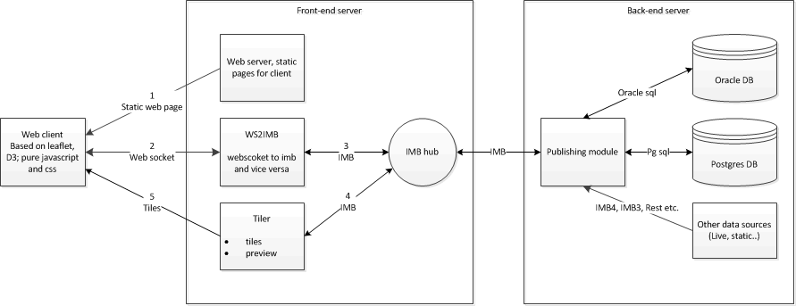

# Design module
All parts of the design module

- [Client](#client)
- [WS2IMB](#ws2imb)
- [Publishing/data server](#publishing)
- [Tiler server](#tiler)
- [Testing](#testing)

- Web browser connects to web server and loads static html/javascript/css files and images
- Web client connects via web socket to WS2IMB for dynamic data
- WS2IMB connects via IMB to Publishing module and registers client on session
- Publishing module generates structures and sends these to the web client via WS2IMB
- Publishing module generates data layers and sends these to Tiler and optionally to web client directly (max number of objects)
- Publishing module sends url for tiles to client via WS2IMB
- Tiler generates preview and sends it to Publishing module which sends it via WS2IMB to the web client
- Tiler generates tiles on request of web client
- other sources send updates of data over IMB4, IMB3 or rest to the publishing server which updates the Tiler server and web client

## Client 
[This is the web client part of the design module](https://github.com/ecodistrict/DesignModule/wiki/WebClient). 
This module is written in html/css/javascript and uses 2 libraries: leaflet and D3. It uses a web socket to communicate to the publishing server. Information layers can be handled in geojson objects or as tiles through the tiles server. The client is a viewer for geo data layers, charts and kpis but can also be used to apply measures to underlying data objects. It also supports retrieval and changing of object properties. Information layers can be filtered by domains to make selection easier. Also objects can be positioned and drawn on the map which trigger connected modules.

## WS2IMB 
This part of the design module is a C# web service that connects the web client via web sockets to the IMB framework. Every web socket connected from the web client connects to an event registered on the publishing server that uses a specific object to represent the client within the publishing server. Messages are all strings containing JSON. Data from the publishing server to the web client are also sent over this web socket (bi-directional) to trigger updating the web client interface. 

## Publishing/data server 
This part of the design module handles all the server side work for the web client. The web clients talks over a web socket via IMB to this server. The publishing server internally handles all its actions via classes 

- module (1 per project type)
- project, represents a case within ecodistrict/urban strategy/other project type. A specific project type is created to handle specific actions and data
- scenario, existing case content or a variant
- scenario elements
	- layers, to visualise geo-data
	- charts, like bar, line, stacked bars etc. graphs
	- kpis, bullits graphs to visualize kpi values (not used in ecodistrict)
- client, represents the specific web client that is started from the dashboard

An other part of the publishing server is the data module. This module handles access to the database over the IMB framework. 

- [data requests, JSON message formats](jsonrequests.md)
- [dynamic queries](dynamicqueries.md)

## Tiler server 
Creates tiles (256*256 pixels bitmaps in png format) out of geo data. Layers are defined over IMB and connect to data events. Several layer formats are supported

- receptor, a set of points with a value that are triangulated and colored according a given palette based on the value.
- geometries, colored by a given palette on a geometry property value.
	- polygon, value
	- lines, value
	- road intensity/capacity, color and width
	- road intensity/capacity R/L right/left values/width
	
- POI, an image at a point from a list of images (png)
- PNG,  an image over the map specified by an extent (xmin,ymin,xmax,ymax)
- location, circle with outline/fill color
- diff layers, difference between 2 layers of type above

The tiler server creates tile on url request with zoom level, x index, y index, layer id and time reference

All layers can have a time reference

The server is implemented as an isapi module (IIS dll)

The server supports 3 access methods

- a default handler that shows a status page of all registered layers and IMB event the server is controlled by
- /tiles: request a tile `/tiles?layer=<id>&zoom=<zoomlevel>&x=<tile-x-index>&y=<tile-y-index>[&time=<yyyymmddhhmmss>]`
- /point: request a value at a specific location `/point?layer=<id>&lat=<latitude>&lon=<longitude>[&time=<yyyymmddhhmmss>]` where lat and lon are in wgs84 degrees (float)
- /status: a status page that shows connected services

## Testing 

- link to main page design module [http://vps17642.public.cloudvps.com](http://vps17642.public.cloudvps.com "main page design module")
- link to web socket page [http://vps17642.public.cloudvps.com:8080/sessions](http://vps17642.public.cloudvps.com:8080/sessions "test page web socket connection")
- link to the default tiler server [http://vps17642.public.cloudvps.com/tiler/TilerWebService.dll](http://vps17642.public.cloudvps.com/tiler/TilerWebService.dll "tiler default page")
- link to the tiler server status [http://vps17642.public.cloudvps.com/tiler/TilerWebService.dll/status](http://vps17642.public.cloudvps.com/tiler/TilerWebService.dll/status "tiler default page")

