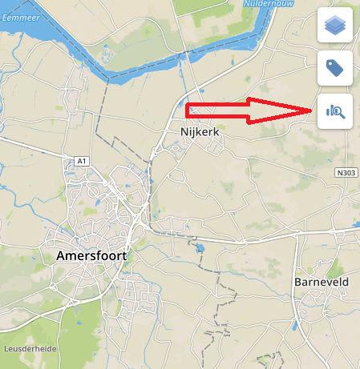
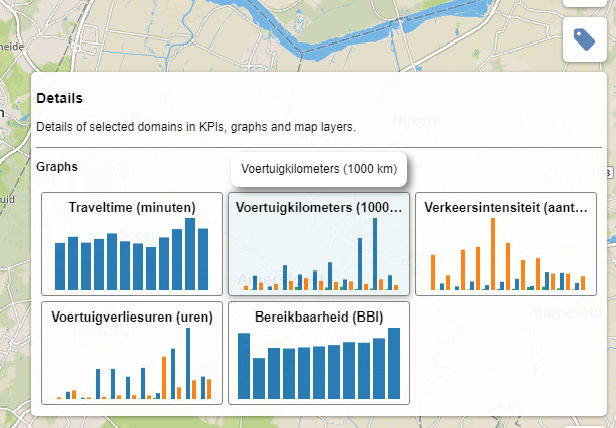
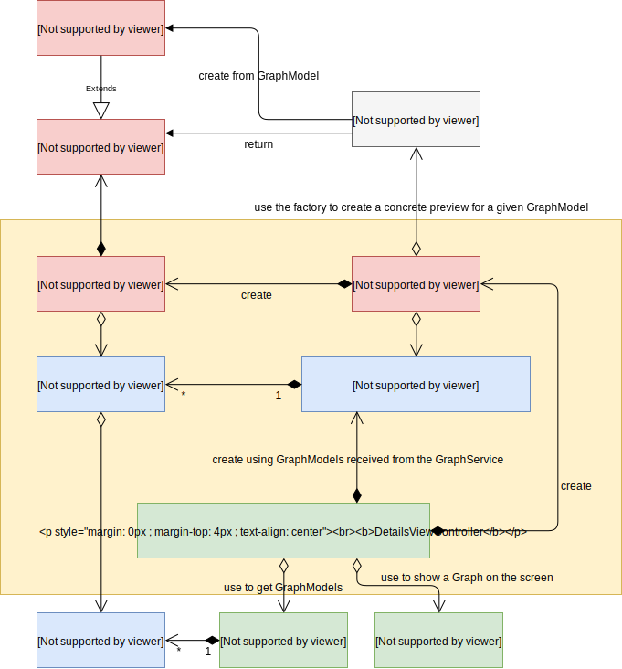

# Details

*Details* component allows selecting KPIs, graphs and map layers.

Details panel can be open by hovering the following control



Details panel is split on sections determined by items type, i.e. graphs, KPIs and layers sections.



* [Features](#features)
* [To do list](#todoList)
* [Architecture](#architecture)
    * [DetailsViewController](#detailsViewController)
    * [DetailsView](#detailsView)
    * [DetailsItemView](#detailsItemView)
    * [DetailsItemViewModel](#detailsItemViewModel)
* [API reference](#apiReference)
    * [DetailsViewController](#detailsViewControllerApi)
        * [How to extend DetailsViewController to support KPIs and Layers](#detailsViewControllerHowToExtend)
    * [DetailsView](#detailsViewApi)
        * [How to extend DetailsView to support KPIs and Layers](#detailsViewHowToExtend)
    * [DetailsItemView](#detailsItemViewApi)
    * [DetailsItemViewModel](#detailsItemViewModelApi)

## Features <a name="features"></a>

- Supports graphs selection.

## To do list <a name="todoList"></a>

- Implement map layers support.
- Implement KPIs support.

## Architecture <a name="architecture"></a>

UML diagram is not yet complete because it is lacking map layers and KPIs implementation. Current diagram only demonstrates graphs implementation within *Details* component.



### DetailsViewController <a name="detailsViewController"></a>

*[DetailsViewController](#detailsViewControllerApi)* creates view to display the details panel and collects models to be shown within details panel from different services. Passes the models to the view.

### DetailsView <a name="detailsView"></a>

*[DetailsView](#detailsViewApi)* represents a details panel. Creates sections for graphs, KPIs and layers and fills these sections with models received from the controller. Creates *DetailsItemView* instance for each model in each section. Also is responsible for providing a preview creator function to each *DetailsItemView* instance.

### DetailsItemView <a name="detailsItemView"></a>

*[DetailsItemView](#detailsItemViewApi)* is a *View* that represents a single preview. Preview is passed to the *DetailsItemView* as usual [View](../../core/view/view.md) therefore *DetailsItemView* doesn't know anything about concrete preview implementations. *DetailsItemView* is just a container where preview will be rendered.
*DetailsItemView* visualizes model state that is injected into it. The model is changed outside the *DetailsItemView*.

### DetailsItemViewModel <a name="detailsItemViewModel"></a>

*[DetailsItemViewModel](#detailsItemViewModelApi)* is a model representing details item state to be visualized.

## API reference <a name="apiReference"></a>

### DetailsViewController <a name="detailsViewControllerApi"></a>

Extends the [L.Evented](https://leafletjs.com/reference-1.0.0.html#evented) class therefore it provides convenient subscription methods like *on(...)* and *off(...)*.

#### Usage example <a name="detailsViewControllerUsageExample"></a>

```javascript
var map = ...
var graphService = ...
var graphPreviewFactory = ...

var detailsViewController = new DetailsViewController({
    graphService: graphService,
    graphViewManager: graphViewManager,
    graphPreviewFactory: graphPreviewFactory
});
map.addControl(detailsViewController.view());
```

#### Options <a name="detailsViewControllerOpts"></a>
When constructing DetailsViewController an options object should be passed to constructor.

| Property | Type | Description |
|---|---|---|
| graphService | [GraphService](../graph/graph.md#graphService) | Source of the *GrpahModel* objects that represent graphs to be shown in the details panel. |
| graphViewManager | [GraphViewManager](../graph/graph.md#graphViewManager) | Manager that is used to show a graph on the screen. |
| graphPreviewFactory | [GraphPreviewFactory](../graph/graph.md#graphPreviewFactory) | Facroty that produces previews for given graphs. |

#### Methods <a name="detailsViewControllerMethods"></a>

| Method | Returns | Description |
|---|---|---|
| view() | [DetailsView](#detailsViewApi) | Returns *DetailsView* object created by the controller. |
| remove() | void | Removes the *DetailsViewController* object and releases allocated resources. |

#### How to extend DetailsViewController to support KPIs and Layers <a name="detailsViewControllerHowToExtend"></a>
Currently *Details* component supports only graphs but it can be easily extended to support KPIs and map layers.

- Inject layers and KPIs services into *DetailsViewController*;
- *DetailsViewController* should subscribe on layers and KPIs collections `change` event and fill `this._kpiItemsModel` and `this._layersItemsModel` collections repectivly;
- *DetailsViewController* should subscribe on layers and KPIs collections `remove` event and hide layer or KPI repectivly;
- Toggle layers visibility within `_onLayerItemClicked()` method;
- Toggle KPIs visibility within `_onKpiItemClicked()` method.

### DetailsView <a name="detailsViewApi"></a>

Extends the [View](../../core/view/view.md) class.

Extends the Leaflet [Control](https://leafletjs.com/reference-1.0.0.html#control) class.

#### How to extend DetailsView to support KPIs and Layers <a name="detailsViewHowToExtend"></a>
Currently *Details* component supports only graphs but it can be easily extended to support KPIs and map layers.

- Implement `_createKpiItemView()` method in a way to create a *DetailsItemView* instace representing KPI preview;
- Implement `_createLayerItemView()` method in a way to create a *DetailsItemView* instace representing map layer preview.

### DetailsItemView <a name="detailsItemViewApi"></a>

Extends the [View](../../core/view/view.md) class.

### DetailsItemViewModel <a name="detailsItemViewModelApi"></a>

Extends the [L.Evented](https://leafletjs.com/reference-1.0.0.html#evented) class therefore it provides convenient subscription methods like *on(...)* and *off(...)*.

#### Options <a name="detailsItemViewModelOpts"></a>
When constructing DetailsItemView an options object should be passed to constructor.

| Property | Type | Description |
|---|---|---|
| id | string | Model id. |
| title | string | Title to be displayed within a details item view. |
| selected | boolean | Flag indicating if details item is selected or not. When selected the property has value `true`, otherwise `false`. |
| originalModel | object | Original model for which preview is shown, e.g. *GraphModel* instance. |

#### Properties <a name="detailsItemViewModelProperties"></a>

| Property | Type | Description |
|---|---|---|
| id | string | Model id. |
| title | string | Title to be displayed within a details item view. `title` event is emitted when *title* property changes. |
| selected | boolean | Flag indicating if details item is selected or not. When details item is selected then property has value `true`, otherwise `false`. `selected` event is emitted when *selected* property changes. |
| originalModel | object | Original model for which preview is shown, e.g. *GraphModel* instance. |

#### Events <a name="detailsItemViewModelEvents"></a>

| Property | Data | Description |
|---|---|---|
| title | { title: string } | Emitted whenever *title* property of the model changes. |
| selected | { selected: boolean } | Emitted whenever *selected* property of the model changes. When details item is selected then `data.selected` has value `true`, otherwise `false`. |
