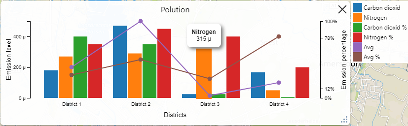
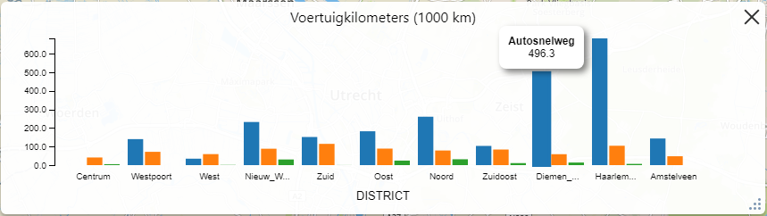
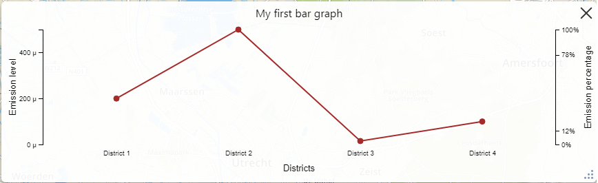

# CategoryGraph

Category graph is a graph that has a discrete `x` axis with categories on it.



Category graph component also provides a preview option.


Category graph can be built from bars and lines which connect points on categories.

* Bars

Each bar is a data point in a single series. Single series can contain an arbitrary number of bars (data points). All bars within a series are grouped and represented with a common color and common title inherited from their series.



* Lines

Each line is defined by a single series where data points are line points.




* [Data format](#dataFormat)
* [Features](#features)
* [To do list](#todoList)
* [Architecture](#architecture)
    * [CategoryGraphView](#categoryGraphView)
    * [CategoryGraphViewController](#categoryGraphViewController)
    * [CategoryGraphViewModel](#categoryGraphViewModel)
    * [CategoryGraphPreview](#categoryGraphPreview)
* [API reference](#apiReference)
    * [CategoryGraphView](#categoryGraphViewApi)
    * [CategoryGraphViewController](#categoryGraphViewControllerApi)
    * [CategoryGraphViewModel](#categoryGraphViewModelApi)
        * [Usage example](#categoryGraphViewModelUsage)
        * [Options](#categoryGraphViewModelOpts)
        * [Properties](#categoryGraphViewModelProperties)
        * [Methods](#categoryGraphViewModelMethods)
        * [Events](#categoryGraphViewModelEvents)
    * [CategoryGraphPreview](#categoryGraphPreviewApi)

## Data format <a name="dataFormat"></a>

Category graph JSON format is defined [here](https://github.com/ecodistrict/publisher-api-documentation/blob/master/doc/api/graph/categoryGraphJsonFormat.md).

## Features <a name="features"></a>

* Can display arbitrary number of *bars* and *lines*.
* Provides a legend if necessary (more than one series present).
* Show/hide series from the graph using legend.
* `y` axes scales defined by the server.
* `y` axes scales calculated from available data if scales are not provided by the server.
* Axis units.
* Bars, lines, categories tooltips. Bar and line tooltips also show their value and corresponding units.
* Number of ticks can be defined for each axis from the server.
* Ticks can be defined for each axis from the server.
* Ticks and tooltips numeric values formatting. For formats see [d3-format](https://github.com/d3/d3-format#locale_format) specification.
* Preview is available. Preview is a simplified version of a graph without any interactivity.

## To do list <a name="todoList"></a>

* Zooming
* Reacting on click by sending corresponding message to the server.

## Architecture <a name="architecture"></a>

The component has the following design in order to show the *View*.


Component contains *Preview* with the following design.


The component has a [Model View Controller](https://en.wikipedia.org/wiki/Model%E2%80%93view%E2%80%93controller) design.

### CategoryGraphView <a name="categoryGraphView"></a>

*[CategoryGraphView](#categoryGraphViewApi) (View)* visually represents a model state on a [GraphView](../graph.md#graphView) viewport and draws scales, bars, lines and line points.

In the Graph data structure bars are grouped within series while when drawing bars on a graph bars are grouped by categories. This distinction causes a need for the additional data type [CategoryGraphViewModel](#categoryGraphViewModel) that will store bars grouped by categories. [CategoryGraphViewController](#categoryGraphViewController) will convert the original model to the [CategoryGraphViewModel](#categoryGraphViewModel) and will pass the model to the *View*. In such way the *View* will work with data that is already prepared for drawing bars and lines.

### CategoryGraphViewController <a name="categoryGraphViewController"></a>

*[CategoryGraphViewController](#categoryGraphViewControllerApi) (Controller)* responsible for creating the [CategoryGraphView](#categoryGraphView) and [CategoryGraphViewModel](#categoryGraphViewModel) objects.

*Controller* converts original [GraphViewModel](../graph.md#graphViewModel) to [CategoryGraphViewModel](#categoryGraphViewModel) and passes it to the *View*. Whenever original model changes *Controller* adjusts the [CategoryGraphViewModel](#categoryGraphViewModel) accordingly so that *View* can update the viewport immediately.

### CategoryGraphViewModel <a name="categoryGraphViewModel"></a>

*[CategoryGraphViewModel](#categoryGraphViewModelApi) (Model)* holds the data needed to draw the bars and lines without any additional data processing from the *View*. Instead of *series* this model has *lines* and *bars* properties that hold corresponding data optimized for passing these objects directly into **d3** functions without additional preparation.

### CategoryGraphPreview <a name="categoryGraphPreview"></a>

*[CategoryGraphPreview](#categoryGraphPreviewApi) (Preview)* is a simple representation of a category graph. It has no animations and doesn't provide any interactions thus doesn't have a controller. All this component does it gets *GraphModel* as an input and builds/updates *CategoryGraphViewModel* which is then used to draw the graph. Whenever *GraphModel* changes the graph is redrawn. This component can be used in constructiong a button that shows a graph.

## API reference <a name="apiReference"></a>

### CategoryGraphView <a name="categoryGraphViewApi"></a>

Extends the [GraphView](../graph.md#graphView) class.

#### Events <a name="categoryGraphViewEvents"></a>

| Property | Data | Description |
|---|---|---|
| graphCategoryClicked | { view: `this`, categoryId: string } | Emitted whenever user clicked a graph category label. |

### CategoryGraphViewController <a name="categoryGraphViewControllerApi"></a>

Extends the [GraphViewController](../graph.md#graphViewController) class.

#### Events <a name="categoryGraphViewControllerEvents"></a>

| Property | Data | Description |
|---|---|---|
| graphCategoryClicked | { graphModel: [GraphModel](../graph.md#graphModelApi), categoryId: string } | Emitted whenever user clicked a graph category label. |

### CategoryGraphViewModel <a name="categoryGraphViewModelApi"></a>

Extends the [L.Evented](https://leafletjs.com/reference-1.0.0.html#evented) class therefore it provides convenient subscription methods like *on(...)* and *off(...)*.

#### Usage example <a name="categoryGraphViewModelUsage"></a>

```javascript
var model = new CategoryGraphViewModel({
    axes: {
        xBottom: {
            title: 'Districts',
            domain: [
                {
                    id: 'dist1',
                    title: 'Amsterdam',
                    tooltip: 'Amsterdam'
                },
                {
                    id: 'dist2',
                    title: 'Utrecht',
                    tooltip: 'Utrecht'
                }
            ]
        },
        yLeft: {
            title: 'Emission',
            domain: [0, 520],
            units: ' kg',
            formatSpecifier: ',.1f',
            ticksCount: 3,
            tickValues: undefined
        }
    },
    lines: [
        {
            seriesId: 'co2avg',
            seriesTitle: 'CO2 average',
            color: '#560550',
            data: [
                { 
                    categoryId: 'dist1',
                    seriesId: 'co2avg',
                    seriesTitle: 'CO2 average',
                    color: '#560550',
                    axisId: 'yLeft',
                    y: 980
                },
                { 
                    categoryId: 'dist2',
                    seriesId: 'co2avg',
                    seriesTitle: 'CO2 average',
                    color: '#560550',
                    axisId: 'yLeft',
                    y: 590
                },
            ]
        }
    ],
    bars: {
        categories: [
            {
                categoryId: 'dist1',
                bars: [
                    {
                        categoryId: 'dist1',
                        seriesId: 'no2avg',
                        seriesTitle: 'NO2 average',
                        color: '#688FE3',
                        axisId: 'yLeft',
                        y: 1024
                    }
                ]
            },
            {
                categoryId: 'dist2',
                bars: [
                    {
                        categoryId: 'dist2',
                        seriesId: 'no2avg',
                        seriesTitle: 'NO2 average',
                        color: '#688FE3',
                        axisId: 'yLeft',
                        y: 850
                    }
                ]
            }
        ]
    }
});

model.on('axes', function (data) { console.log(data.axes); });
model.on('lines', function (data) { console.log(data.lines); });
model.on('bars', function (data) { console.log(data.bars); });
model.on('modelReset', function () { console.log('Model reset'); });

model.axes = {
    xBottom: {
        title: 'DISTRICTS',
        ...
    }
    ...
}; // { xBottom: { title: 'DISTRICTS', ... } ... } will be printed to console

model.lines = [
    {
        seriesId: 'co2avg',
        ...
        data: [
            { 
                ...                
                y: 1080
            },
            ...
        ]
    }
]; // [{ seriesId: 'co2avg', ..., data: [{ ..., y: 1080}, ... }] will be printed to console

model.bars = {
    categories: [
        {
            categoryId: 'dist1',
            bars: [
                {
                    ...
                    y: 500
                }
            ]
        },
        ...
    ]
}; // { categories: [{ categoryId: 'dist1', bars: [{ ..., y: 500 }] }, ...] } will be printed to console

model.set({
    axes: {
        xBottom: {
            ...
        },
        yLeft: {
            ...
        }
    },
    lines: [
        ...
    ],
    bars: {
        categories: [
            ...
        ]
    }
}); // 'Model reset' will be printed to console
```

#### Options <a name="categoryGraphViewModelOpts"></a>

When constructing a model an options object can be passed to constructor.

| Property | Type | Description |
|---|---|---|
| axes | [Axes](#axes) | Axes definition object. *xBottom* is a mandatory field while *yLeft* and *yRight* are optional but at least one of them should be provided. |
| lines | Array &lt;[Line](#line)&gt; | List of lines. |
| bars | [Bars](#bars) | Object containing bars to be displayed. |

#### Properties <a name="categoryGraphViewModelProperties"></a>

| Property | Type | Description |
|---|---|---|
| axes | [Axes](#axes) | Axes definition object. *xBottom* is a mandatory field while *yLeft* and *yRight* are optional but at least one of them should be provided. |
| lines | Array &lt;[Line](#line)&gt; | List of lines. |
| bars | [Bars](#bars) | Object containing bars to be displayed. |

#### Methods <a name="categoryGraphViewModelMethods"></a>

| Method | Description |
|---|---|
| set([opts](#categoryGraphViewModelOpts)) | Sets new values to the model. *opts* has the same structure as *opts* object passed to the constructor. Note that all *opts* fields are mandatory as this function completely resets the model. [modelReset](#categoryGraphViewModelEvents) event is emitted. |

#### Events <a name="categoryGraphViewModelEvents"></a>

| Property | Data | Description |
|---|---|---|
| axes | { axes: [Axes](#axes) } | Event axes. Triggered whenever *axes* property of the model changes. This can happen when *axes* is changed with assign operator or when *set(opts)* method is called. |
| lines | { lines: Array &lt;[Line](#line)&gt; } | Event lines. Triggered whenever *lines* property of the model changes. This can happen when *lines* is changed with assign operator or when *set(opts)* method is called. |
| bars | { bars: [Bars](#bars) } | Event bars. Triggered whenever *bars* property of the model changes. This can happen when *bars* is changed with assign operator or when *set(opts)* method is called. |

#### Axes <a name="axes"></a>

| Property | Type | Description |
|---|---|---|
| xBottom | [Axis](#axis) | Describes an `x` axis of the category graph. Only *title* and *domain* properties are relevant for this axis. Domain is an array of *categories*. |
| yLeft | [Axis](#axis) | *Partly optional*. Describes an `x` axis of the category graph. At least one of the *yLeft* and *yRight* axes should be provided. |
| yRight | [Axis](#axis) | *Partly optional*. Describes an `x` axis of the category graph. At least one of the *yLeft* and *yRight* axes should be provided. |

#### Axis <a name="axis"></a>

| Property | Type | Description |
|---|---|---|
| title | string | Axis title. |
| units | string | Axis units. Will apply also to the bars and lines tooltips. |
| formatSpecifier | string | Ticks format. Refer [d3-format](https://github.com/d3/d3-format#locale_format).  |
| ticksCount | number | Number of desired ticks on the axis. |
| tickValues | Array&lt;number&gt; | Ticks to be displayed on the axis. If this is specified then exactly these ticks will be shown and there will be no auto generated ticks for this axis. This means that this property discards *ticksCount* property when set. |
| domain | Array&lt;number&gt; or Array&lt;[Category](#category)&gt; | Axis domain. `y` axes uses numeric domain while `x` axis uses category doamin. |

#### Category <a name="category"></a>

| Property | Type | Description |
|---|---|---|
| id | string | Category id. A unique value that indicates the category within a given graph. |
| title | string | Category title. This property is used to display a tick text on `x` axis. |
| tooltip | string | Tooltip message text to be shown when category is hovered. |

#### Line <a name="line"></a>

| Property | Type | Description |
|---|---|---|
| seriesId | string | Id of the series that this line was build from. |
| seriesTitle| string | Series title. This property will be used in tooltip when line is hovered. |
| color | string | Color of the line in CSS-compatible format. |
| data | Array&lt;[LineDataPoint](#lineDataPoint)&gt; | List of line points. |

#### LineDataPoint <a name="lineDataPoint"></a>

| Property | Type | Description |
|---|---|---|
| categoryId | string | Id of the category this point belongs to. Think of it as of `x` coordinate. |
| seriesId | string | Id of the series this point belongs to. |
| seriesTitle | string | Series title. This property will be used in tooltip when the point is hovered. |
| color | string | Color of the point in CSS-compatible format. |
| axisId | string | Id of the axis to which the `y` value is bind. This property is used to determine `top` position of the point when displayed on the viewport. *axisId* is also used to decorate the `y` value with units when displayed within a tooltip when point is hovered. |
| y | number | `y` value of the point. The value is converted to a `top` coordinate on the viewport using the *axisId*. |

#### Bars <a name="bars"></a>

| Property | Type | Description |
|---|---|---|
| categories | Array&lt;[BarCategory](#barCategory)&gt; | List of all categories with bars within them. |

#### BarCategory <a name="barCategory"></a>

| Property | Type | Description |
|---|---|---|
| categoryId | string | Category id. This field is used like an id of a group that unites a set of bars. |
| bars | Array&lt;[Bar](#bar)&gt; | List of all bars within the category. |

#### Bar <a name="bar"></a>

| Property | Type | Description |
|---|---|---|
| categoryId | string | Id of the category this bar belongs to. Think of it as of `x` coordinate. |
| seriesId | string | Id of the series this bar belongs to. |
| seriesTitle | string | Series title. This property will be used in tooltip when the bar is hovered. |
| color | string | Color of the bar in CSS-compatible format. |
| axisId | string | Id of the axis to which the `y` value is bind. This property is used to determine `top` position of the bar when displayed on the viewport. *axisId* is also used to decorate the `y` value with units when displayed within a tooltip when bar is hovered. |
| y | number | `y` value of the bar. The value is converted to a `top` coordinate on the viewport using the *axisId*. |

### CategoryGraphPreview <a name="categoryGraphPreviewApi"></a>

Extends the [View](../../../core/view/view.md) class.
