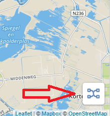
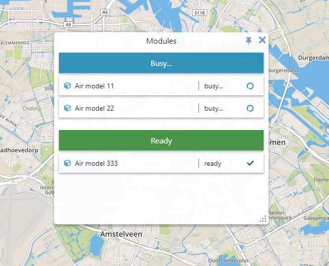
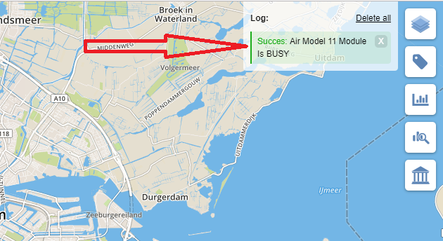

# ModuleControl

ModuleControl component represents all modules/models (e.g. Air module, Traffic module) available for the current session.

Module control window can be open by pressing the following toggle button

Module control window displays the list of modules that are connected to the session. The modules can be ready or busy.

Whenever module changes its status a corresponding toast will be shown.

* [Architecture](#architecture)
    * [ModuleControlComponent](#moduleControlComponent)
    * [ModuleService](#moduleService)
    * [ModuleModel](#moduleModel)
    * [ModuleToastsController](#moduleToastsController)
    * [ModuleControlWindow](#moduleControlWindow)
        * [ModuleControlWindowViewModel](#moduleControlWindowViewModel)
        * [ModuleControlWindowView](#moduleControlWindowView)        
        * [ModuleControlWindowViewController](#moduleControlWindowViewController)
    * [ModuleControlToggle](#moduleControlWindow)
        * [ModuleControlToggleViewModel](#moduleControlToggleViewModel)
        * [ModuleControlToggleView](#moduleControlToggleView)        
        * [ModuleControlToggleViewController](#moduleControlToggleViewController)
* [API reference](#apiReference)
    * [ModuleControlComponent](#moduleControlComponentApi)
    * [ModuleService](#moduleServiceApi)
    * [ModuleModel](#moduleModelApi)
    * [ModuleToastsController](#moduleToastsControllerApi)
    * [ModuleControlWindowViewModel](#moduleControlWindowViewModelApi)
    * [ModuleControlWindowView](#moduleControlWindowViewApi)
    * [ModuleControlWindowViewController](#moduleControlWindowViewControllerApi)
    * [ModuleControlToggleViewModel](#moduleControlToggleViewModelApi)
    * [ModuleControlToggleView](#moduleControlToggleViewApi)
    * [ModuleControlToggleViewController](#moduleControlToggleViewControllerApi)

## Architecture 

ModuleControl component consists of several domains:

* *ModuleControlService* provides Module models to the application;
* *ModuleControlWindow* (*ModuleControlWindowViewController-ModuleControlWindowViewModel-ModuleControlWindowView*) is a window that shows a list of modules connected to the current session.
* *ModuleControlToggle* (*ModuleControlToggleViewController-ModuleControlToggleViewModel-ModuleControlToggleView*) represents a toggle button that opens/closes the module control window;
* *ModuleToastsController* responsible for showing toasts notifications to a user reagarding modules status changes.

All pieces related to modules are encapsulated within ModuleControlComponent class.

### ModuleControlComponent 

*[ModuleControlComponent](#moduleControlComponentApi)* creates, configures and stores all ModuleControl-related entities like *ModuleControlService*, *ModuleControlWindowViewController*, etc.

### ModuleService 

*[ModuleService](#moduleServiceApi)* provides modules models to the application.

### ModuleModel 

*[ModuleModel](#moduleModelApi)* is an application level model that stores data describing a module and provides simple ways to monitor data changes via subscriptions. This model is not dedicated for view but is a logical representation of a module.

### ModuleToastsController 

*[ModuleToastsController](#moduleToastsControllerApi)* monitors changes in the modules and shows toasts notifications modules' status change.

### ModuleControlWindow 

*ModuleControlWindow* is a UI component that displays the list of the modules and has [MVC](https://en.wikipedia.org/wiki/Model%E2%80%93view%E2%80%93controller) architecture.

#### ModuleControlWindowViewModel 

*[ModuleControlWindowViewModel](#moduleControlWindowViewModelApi)* is a Model in MVC pattern and it provides data that is needed by View for rendering.

#### ModuleControlWindowView 

*[ModuleControlWindowView](#moduleControlWindowViewApi)* is a View in MVC pattern and is responsible for modules representation as a separate window. View is responsible only for showing the data received from the Model and not for modifying it. View produces events when somthing need to be done and it is a responsibility of Controller how to react on them.

#### ModuleControlWindowViewController 

*[ModuleControlWindowViewController](#moduleControlWindowViewControllerApi)* is a Controller in MVC pattern and is responsible for handling View events and actions and adapting the ViewModel accordingly. *ModuleControlWindowViewController* receives ModuleModel collection as an input and converts it to the *ModuleControlWindowViewModel*. *ModuleControlWindowViewController* creates *ModuleControlWindowView* and passes *ModuleControlWindowViewModel* model into the View.

### ModuleControlToggle 

*ModuleControlToggle* is a toggle button that can open/close the module control window and shows a spiner when there are busy modules. This UI component has [MVC](https://en.wikipedia.org/wiki/Model%E2%80%93view%E2%80%93controller) architecture.

#### ModuleControlToggleViewModel 

*[ModuleControlToggleViewModel](#moduleControlToggleViewModelApi)* is a Model in MVC pattern and it provides data that is needed by View for rendering.

#### ModuleControlToggleView 

*[ModuleControlToggleView](#moduleControlToggleViewApi)* is a View in MVC pattern and is responsible for modules representation as a separate window. View is responsible only for showing the data received from the Model and not for modifying it. View produces events when somthing need to be done and it is a responsibility of Controller how to react on them.

#### ModuleControlToggleViewController 

*[ModuleControlToggleViewController](#moduleControlToggleViewControllerApi)* is a Controller in MVC pattern and is responsible for handling View events and actions and adapting the ViewModel accordingly. *ModuleControlToggleViewController* receives ModuleModel collection as an input and converts it to the *ModuleControlToggleViewModel*. *ModuleControlToggleViewController* creates *ModuleControlToggleView* and passes *ModuleControlToggleViewModel* model into the View.

## API reference 

### ModuleControlComponent 

Extends the [L.Evented](https://leafletjs.com/reference-1.0.0.html#evented) class therefore it provides convenient subscription methods like *on(...)* and *off(...)*.

#### Options 

When constructing ModuleControlComponent an options object should be passed to constructor.

| Property | Type | Description |
|---|---|---|
| map | object | Leaflet map instance. *map* will be used to place the toggle button on the screen. |
| windowManager | [WindowManager](../../core/window/windowManager/windowManager.md) | Reference to  a container for WindowView objects (windows). ModuleControl window will be managed by *windowManager*. |
| toastFunction | `function (message, messageType, timeout)` | The function will be used to show module-related toasts. |

#### Methods 

| Method | Returns | Description |
|---|---|---|
| service() | [ModuleService](#moduleServiceApi) | Returns *ModuleService* object created by the component. The service can be used to get modules models provided by the backend. |
| remove() | void | Removes and deinitialize the entire *ModuleControlComponent*. |

### ModuleService 

Extends the L.Evented class therefore it provides convenient subscription methods like on(...) and off(...).

#### Properties 

| Property | Type | Description |
|---|---|---|
| modules | [ModelCollection](../../core/modelCollection/modelCollection.md) | [Module model](#moduleModelApi) collection. |
| enabled | boolean | Indicates if the feature is enabled. `true` means that *ModuleControl* feature is enabled and `false` means that it is disabled. When value changes the `enabled` [event](#moduleServiceEvents) is emitted. |

#### Methods 

| Method | Returns | Description |
|---|---|---|
| remove() | void | Removes and deinitialize the service. |

#### Events 

| Property | Data | Description |
|---|---|---|
| enabled | { enabled: boolean } | Emitted whenever feature gets enabled or disabled. |

### ModuleModel 

Extends the [L.Evented](https://leafletjs.com/reference-1.0.0.html#evented) class therefore it provides convenient subscription methods like *on(...)* and *off(...)*.

#### Options 
When constructing ModuleModel an options object should be passed to constructor.

| Property | Type | Description |
|---|---|---|
| id | string | Model id. |
| name | string | Module name. |
| status | [ModuleStatus](#moduleModelStatus) | String indicating the module status. |
| progress | number | Module calculation progress. The value is not unified. |

#### Properties 

| Property | Type | Description |
|---|---|---|
| id | string | Model id. |
| name | string | Module name. `name` [event](#moduleModelEvents) is emitted when *name* property changes.  |
| status | [ModuleStatus](#moduleModelStatus) | String indicating the module status. `status` [event](#moduleModelEvents) is emitted when *status* property changes. |
| progress | number | Module calculation progress. The value is not unified. `progress` [event](#moduleModelEvents) is emitted when *progress* property changes. |

If any of the properties changes then `change` [event](#moduleModelEvents) is emitted.

#### Methods 

| Method | Returns | Description |
|---|---|---|
| set(opts) | void | Sets the new values to the model. `opts` is an object with the same structure as [options](#moduleModelOpts) for cunstructor except `id` field. All fields in `opts` object are optional. If at least one property is changed then `change` [event](#moduleModelEvents) is emitted. |

#### Events 

| Property | Data | Description |
|---|---|---|
| name | { name: string, module: *ModuleModel* } | Emitted whenever *name* property of the model changes. |
| status | { status: [ModuleStatus](#moduleModelStatus), module: *ModuleModel* } | Emitted whenever *status* property of the model changes. |
| progress | { name: number, module: *ModuleModel* } | Emitted whenever *progress* property of the model changes. |
| change | { module: *ModuleModel* } | Emitted whenever any property of the model changes. |

#### ModuleStatus 

| Property | Description |
|---|---|
| 'idle' | Module is not claimed. | 
| 'locked' | Module is locked and can't be used right now. |
| 'busy' | Module is loading or doing calculations. |
| 'ready' | Module is ready for calculations. |
| 'calc' | Module is doing calculations |
| 'removed' | Module is removed. |

### ModuleToastsController 

Extends the [L.Evented](https://leafletjs.com/reference-1.0.0.html#evented) class therefore it provides convenient subscription methods like *on(...)* and *off(...)*.

#### Options 
When constructing ModuleToastsController an options object should be passed to constructor.

| Property | Type | Description |
|---|---|---|
| modules | [ModelCollection](../../core/modelCollection/modelCollection.md) | [Module model](#moduleModelApi) collection. |
| toastFunction | `function (message, messageType, timeout)` | The function will be used to show module-related toasts. |

#### Methods 

| Method | Returns | Description |
|---|---|---|
| remove() | void | Removes and deinitialize the controller. |

### ModuleControlWindowViewModel 

Extends the [L.Evented](https://leafletjs.com/reference-1.0.0.html#evented) class therefore it provides convenient subscription methods like *on(...)* and *off(...)*.

### ModuleControlWindowView 

Extends the [WindowView](../../core/window/windowView/windowView.md) class.

**Note.** *ModuleControlWindowView* divides the window view on two sections: one for busy modules and other for ready modules.
Each section has a caption and a list of modules. Currently such modules list is implemented in *ModuleControlItemListView* class which is responsible for adding module items into the *div* managed by the *ModuleControlItemListView*. Each module item in the list is represented with *ModuleControlItemView-ModuleControlItemModel* pair. *ModuleControlItemView* is just a visual representation of a module in the list. *ModuleControlItemModel* is data needed for the *ModuleControlItemView*. *ModuleControlWindowViewController* is responsible for creating *ModuleControlItemModel*s from *ModuleModel*s. The exact set of fields and functions of *ModuleControlItemListView* and *ModuleControlItemView-ModuleControlItemModel* is not importent from the architecture point of view therefore is not present in this documentation, think about it as of private implementation. The reason these private classes are mentioned here is to give a better idea of how the component build.

### ModuleControlWindowViewController 

Extends the [L.Evented](https://leafletjs.com/reference-1.0.0.html#evented) class therefore it provides convenient subscription methods like *on(...)* and *off(...)*.

#### Options 
When constructing ModuleControlWindowViewController an options object should be passed to constructor.

| Property | Type | Description |
|---|---|---|
| modules | [ModelCollection](../../core/modelCollection/modelCollection.md) | [Module model](#moduleModelApi) collection. |

#### Methods 

| Method | Returns | Description |
|---|---|---|
| remove() | void | Removes and deinitialize the controller and destroys the view. |
| view() | [View](../../core/view/view.md) | Returns *View* created by the controller. |
| model() | [ModuleControlWindowViewModel](#moduleControlWindowViewModelApi) | Returns view model created by the controller and used by the view. |
| hideModuleControlWindowView() | void | Shows the module control window (*View*). |
| showModuleControlWindowView() | void | Hides the module control window (*View*). |
| toggleModuleControlWindowView() | void | toggles the visibility of the module control window (*View*). |

### ModuleControlToggleViewModel 

Extends the [L.Evented](https://leafletjs.com/reference-1.0.0.html#evented) class therefore it provides convenient subscription methods like *on(...)* and *off(...)*.

#### Options 
When constructing ModuleControlToggleViewModel an options object should be passed to constructor.

| Property | Type | Description |
|---|---|---|
| loading | boolean | `true` when loading status should be shown (e.g. spinner), otherwise `false`. |

#### Properties 

| Property | Type | Description |
|---|---|---|
| loading | boolean | `true` when loading status should be shown (e.g. spinner), otherwise `false`. `loading` [event](#moduleControlToggleViewModelEvents) is emitted when *loading* property changes. |

#### Events 

| Property | Data | Description |
|---|---|---|
| loading | { loading: boolean } | Emitted whenever *loading* property of the model changes. |

### ModuleControlToggleView 

Extends the [View](../../core/view/view.md) class.

### ModuleControlToggleViewController 

Extends the [L.Evented](https://leafletjs.com/reference-1.0.0.html#evented) class therefore it provides convenient subscription methods like *on(...)* and *off(...)*.

#### Options 
When constructing ModuleControlToggleViewController an options object should be passed to constructor.

| Property | Type | Description |
|---|---|---|
| modules | [ModelCollection](../../core/modelCollection/modelCollection.md) | [Module model](#moduleModelApi) collection. |

#### Methods 

| Method | Returns | Description |
|---|---|---|
| remove() | void | Removes and deinitialize the controller and destroys the view. |
| view() | [View](../../core/view/view.md) | Returns *View* created by the controller. |
| model() | [ModuleControlToggleViewModel](#moduleControlToggleViewModelApi) | Returns view model created by the controller and used by the view. |

#### Events 

| Property | Data | Description |
|---|---|---|
| moduleControlToggle | `undefined` | Emitted whenever toggle button (*View*) is clicked. |
