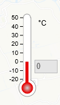
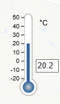

# TemperatureControl

Control that can be used to either view the live temperature condition or set a temperature value to see its effects.

 

## Features

* Displays live temperature data (by default).
* Temperature can be changed by the following 3 ways:
    * Clicking anywhere inside the thermometer.
    * Clicking on the mercury and dragging it up or down.
    * Change the temperature value in the input (textbox) next to the thermometer.
* Following temperature units are supported - K, °C, °F, °R
* Click on the label next to the thermometer to view a dropdown displaying all the available units.

## Architecture

This component consists of a Model-View design.

**temperatureControlModel** is the source of the data. It contains 2 parameters along with their getters and setters - value & temperatureUnit. This model supports a subscription mechanism for  tracking its state. Whenever the model state is changed, a corresponding event is emitted.

**temperatureControlView** visually represents the state of the model using a thermometer. By default, the live values for the temperature are displayed but, when a user makes changes to the temperature value, a call is made to the model to update the parameters. This leads to an event change event which leads to the visual components being updated to reflect these changes.

## View states

<table class="temperatureViewStates">
<tr><td></td>
    <td></td></tr>
<tr align="center"><td>Live State</td><td>Edit State</td></tr>
</table>

The **temperatureControlView** has 2 states - live & edit.

In the live state, the live temperature is displayed but when the user left-clicks anywhere inside the thermometer or left-click on the mercury and drag it, the color of the mercury changes to blue (representing the edit state). Once in the edit state, user can change the value inside the textbox to change the mercury level too.

To return back to the live state, the user can right-click anywhere inside the control.

## API reference

### Temperature Control Model

**temperatureControlModel** extends L.Evented class and hence provides convenient subscription methods like *on(...)* & *off(...)*.

#### Options

| Property | Type | Description |
|---|---|---|
| value | float | The temperature value. |
| temperatureUnit | String | The temperature unit to be displayed. Initial value - '°C'. Possible values - 'K', '°C', '°F', '°R'. |

#### Properties

| Property | Type | Description |
|---|---|---|
| value | float | Represents the current value of the model. When a new value is assigned, a value event is emitted. |
| temperatureUnit | String | Represents the current temperature unit to be displayed. When a new value is assigned, a temperatureUnit event is emitted. |

#### Events

| Property | Type | Description |
|---|---|---|
| value | {value: &lt;float&gt;} | Event emitted when the value property is changed. |
| temperatureUnit | {value: &lt;String&gt;} | Event emitted when the temperatureUnit property is changed. |

### Temperature Control View

**temperatureControlView** extends L.Evented class and hence provides convenient subscription methods like *on(...)* & *off(...)*.

#### Methods

| Method | Description |
|---|---|
| svgImageInitialization() | Creates a SVG image upon which the whole thermometer design is added. |
| createThermometerStructure() | Constructs the design of the thermometer along with a click event to handle the mercury level. |
| createMercuryBar() | Constructs the mercury bar inside the thermometers and alls drag and click events to control the mercury level. |
| mercuryBulbGradientInitialization(&lt;String&gt; gradientId, &lt;String&gt; mercuryColor) | Initializes the gradient for the mercury bulb in the thermometer. |
| axisInitialization() | Depending upon the selected temperature unit, this function initializes the axis to be displayed next to the thermometer. |
| unitControlParentDivInitialization() | Constructs the drop down div containing all the temperature unit options. |
| temperatureTextboxInitialization() | Constructs the textbox along with it's on-input event to handle the mercury level. |

