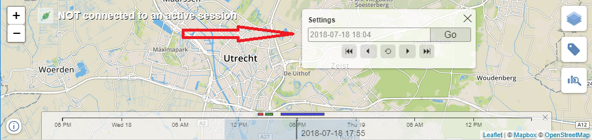
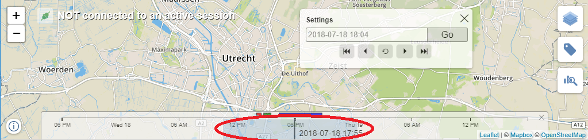

# TimeSlider
UI component for displaying and manipulating a timeline.

It consists of several components
* Toggle button that shows the TimeSlider control when clicked

* TimeSlider control. This control allows setting current time, applying a brush, displaying time-anchored events.

* Time slider settings dialog. Allows more precise setup of the selected date-time. Click on current date label to open the dialog.

1. [Features](#ComponentFeatures)
2. [To do list](#todo)
3. [Architecture](#architecture)
4. [API reference](#apiReference)
    1. [TimeSliderController](#TimeSliderControllerApi)
        1. [Create options](#createOptions)
        2. [Methods](#methods)
        3. [Server message payload](#serverMessagePayload)
        4. [Client message](#clientMessage)

## Features 
* Display and modify current date-time by scrolling and zooming. 
* A separate Settings dialog window to configure the time.
* Brush to select a time range. Brush can be created and destroyed with right mouse click or long touch.

* Display events anchored to a time range.

* Brush feature can be enabled/disabled from the server side.
* The following can be configured from the server side:
    * current time
    * current brush
    * events (can be set and added)
    * current zoom level    
* The following is reported to the server side:
    * current time
    * current brush
    * selected event
    * current zoom level

## To do list 
* Display events in multiline.
* Simulation control that supports the *play*, *stop*, *pause* and *record* actions.
* Zoom over Brush using gestures.

## Architecture 

The component has Model View Controller (MVC) design. 

[**TimeSliderController (Controller)**](#TimeSliderControllerApi) holds the model and all the views. Controller makes a decision when to show or hide each view. Also controller communicates with server and process server messages. Regarding to server message controller can change the model state or directly ask any view to do some additional actions. Also Controller is responsible for sending messages back to the server, e.g. when model is changed.

**Model**. There is no dedicated model for this component, instead [*ScaleSliderModel*](../scaleSlider/scaleSlider.md#ScaleSliderModel) is used.

**View** is not a single entity but a set of different *View-components*.

**View. TimeSliderToggleView** is a view component that displays a toggle button. *Controller* makes sure that this buttot is shown when the TimeSlider is collapsed. When clicking on the toogle button *Controller* hides the button and shows the TimeSlider.

**View. TimeSliderView** displays the *time slider*. This view uses [*ScaleSliderView*](../scaleSlider/scaleSlider.md) to show the slider and customizes it to show time-based data within a correct scale. The initial scale is `[selectedDte - day, selectedDte + day]`

**View. TimeSliderSettings** is a dialog window that allows setting the selected date.

## API reference 

## TimeSliderController 

### Options 
Options object that should be passed to *Controller's* constructor.

| Property | Description |
|---|---|
| map | Leaflet map object. The map will be used to place a time slider toggle button. |

### Methods 

| Method | Description |
|---|---|
| createTimeSlider(&lt;[TimeSliderDisplayMode](#TimeSliderDisplayMode)&gt; mode, [options](#createTimeSliderOptions)) | Shows time slider related views taking the *mode* and *options* into account. *mode* determine weather *time slider* should be collapsed or expanded. *options* is an arbitrary argument and can be used to specify features, e.g. enable/disable brush feature. See [option](#createTimeSliderOptions) section.  |
| removeTimeSlider() | Hides all time slider related views: time slider, toggle button and settings window.  |
| processServerMessage([messagePayload](#serverMessagePayload)) | Processes json-formatted server messages specific to time slider. *Controller* decides how to handle a message, in some cases *Controller* just changes the model in other cases *Controller* manipulates several *views*. See [server message payload](#serverMessagePayload) section. |

### Server message payload 
Message payload is an object where each property name represents an action to be done while property value represents action's data or settings. All properties are arbitrary.

| Property | Type | Description |
|---|---|---|
| setEvents | Array &lt;[Event](#event)&gt; | Sets events array to be shown on the time slider. If there were already events shown then they will be replaced with these new ones. |
| addEvents | Array &lt;[Event](#event)&gt; | Extends current time slider events array with additional events. All events will be shown on the time slider. |
| setCurrentTime | string  | Sets the current time. The value of this property is a string in following [time format](#timeFormat). Current time will be immediately displayed in the time slider and time slider's scale will be centered at this time. The zoom level of the time slider will remain. |
| setBrush | [Brush](#brush) | Selects a time range. If brush feature is enabled then corresponding time range will be displayed on the time slider as [d3-brush](https://github.com/d3/d3-brush) object. *Brush* can either be `{ }` or a [Brush](#brush) object. `{ }` means that there is no brush. |
| setZoomLevel | number | Sets a zoom level for the time slider. The zoom level will affect the scale, brush and events representation, they will be zoomed accordingly. As for *scale*, zoom level is applied to initial scale which is `[currentTime - 24h, currentTime + 24h]`. Zoom level of `2` will result in displaying a scale `[currentTime - 12h, currentTime + 12h]` while zoom level `0.5` will display a scale `[currentTime - 48h, currentTime + 48h]`. Note that *brush* and *events* representations will be scaled accordingly. |

### Client message 
*Controller* is responsible for sending messages to server whenever *time slider* state changes.
The message is a json with two properties

| Property | Type | Description |
|---|---|---|
| type | string | This property represent a message source. For time slider the value is **always** `'timeslider'`. |
| payload | object | Payload is an object specific to a certain time slider message. [Check the possible options](#clientMessagePayload). |

#### Client message payload 
Payload is an object which can contain one of the following properties.

| Property | Type | Description |
|---|---|---|
| active | boolean | Indicates whether *time slider* is shown. `true` when shown, `false` when hidden. This message is sent whenever time slider visibility changes, e.g. when time slider is collapsed, expanded or removed.|
| selectedTime | string | Currently selected time as a string of the following [time format](#timeFormat). This message is sent each time the current time changes. |
| brush | [Brush](#brush) | Current time range selection. *Brush* can either be an empty object `{ }` or a [Brush](#brush) object. `{ }` means that there is no brush. This message is sent each time the current brush changes. |
| selectedEvent | [Event](#event) | Selected event is sent with this message whenever user selects an event by clicking on it. |
| zoomLevel | number | Current zoom level of the time slider. The initial zoom level is `1` and it corresponds to a time range `[currentTime - 24h, currentTime + 24h]`. Zoom level of `2` corresponds to `[currentTime - 12h, currentTime + 12h]` while zoom level `0.5` corresponds to `[currentTime - 48h, currentTime + 48h]`. This message is sent each time the current zoom level changes, e.g. when user does a wheel scrolling on time slider. |

### TimeSliderController types 

#### TimeSliderDisplayMode 
Object that stores display mode constants as its properties.

| Property | Value | Description |
|---|---|---|
| COLLAPSE | 1 | Show the time slider collapsed (hidden). The toggle button will be shown. |
| EXPAND | 2 | Show the time slider expanded. The toggle button will be hidden. |

#### Create time slider options 
Option object allows specify time slider features. Note that these settings are applicable on the fly therefore server can disable or enable any feature at any time.

| Property | Description |
|---|---|
| features | Features map(hashtable) object. Feature name is a key of the map and boolean indicating feature enabled/disable is a value. See [features](#features) for more details. |

#### Features 
Object specifying features set. If a feature is not mentioned in this object then a current mode of the feature will be used. Each feature has an initial default value that is used during the startup and this default value becomes a current value. Current value can be changed at any time.

| Property | Type | Default | Description |
|---|---|---|---|
| brush | boolean | true | Brush feature is the ability to make a time range selection using brush. When brush is enabled time slider will allow user to create/remove a brush using right mouse click. In such case all brush changes will be sent to the server. Also server can send a *brush* message and it will be reflected on the time slider. When *brush* is disabled then it will never be shown on the time slider and server will not be informed of any *brush* change. Set value *true* to enable the brush feature and *false* to disable it. |

#### Event 
| Property | Type | Description |
|---|---|---|
| start | string | Event start time as a string of the following [time format](#timeFormat). |
| end | string | Event end time as a string of the following [time format](#timeFormat). |
| color | string | Event color in CSS-compatible format. This color will be used to fill the event rectangle when showing it on the time scale. |
| tooltip | string | Tooltip text that will be shown when hovering the event rectangle. |
| level | number | Event level in a range `[0..)` Level represents row where this event will be displayed. If Level is not provided then 0 is the default value. **Note** that this feature is not yet supported. |

#### Brush 
| Property | Type | Description |
|---|---|---|
| start | string | Brush start time as a string of the following [time format](#timeFormat). |
| end | string | Brush end time as a string of the following [time format](#timeFormat). |

#### Time format 
The following time format is supported both for server-client communication and for displaying the time in the time slider.

`'%Y-%m-%d %H:%M'`, e.g. `'2018-07-19 16:00'`.

