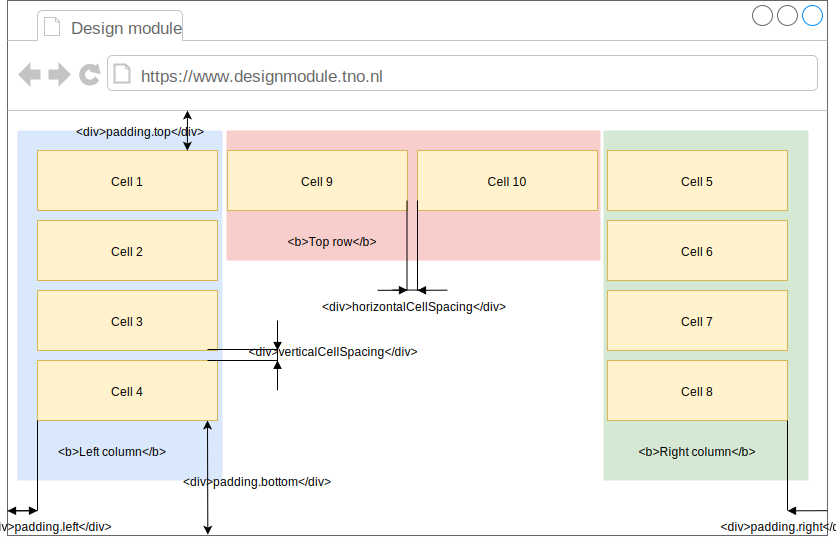

# PerimeterLayout

*Perimeter layout* places layout items within virtual cells along surface borders keeping center and bottom of the surface free. Virtual cells number for each surface border can be specified when constructing the layout.

*Perimeter layout* is split on three zones: left column, right column and top row. Cells within the layout have priority defined by their position form top to bottom for columns and left to right for the row. Also, left column has higher priority than right column while right column has higher priority than top row. When searching for a free space *PerimeterLayout* will return a free cell with a highest priority.

When layout is resized then all cells and corresponding layout items are resized as well in order to keep the layout structure.

## API reference

*PerimeterLayout* implements [Layout](../layout/layout.md) interface.

**Note**. *PerimeterLayout* has exactly the same methods and events as described by [Layout](../layout/layout.md) interface.

**Note**. Layout's [space](../layout/layout.md#space) represents a cell within *PerimeterLayout*.

#### Options
Options object that should be passed to *PerimeterLayout* constructor.

| Property | Type | Description |
|---|---|---|
| padding | [Padding](#padding) | *Optional*. Layout padding relative to the layout's surface geometry. |
| verticalCellSpacing | number | *Optional*. Vertical space between cells in pixels. |
| horizontalCellSpacing | number | *Optional*. Horizontal space between cells in pixels. |
| topRowCellCount | number | *Optional*. Number of cells in the top row. By default is `2`. |
| leftColumnCellCount | number | *Optional*. Number of cells in the left column. By default is `4`. |
| rightColumnCellCount | number | *Optional*. Number of cells in the right column. By default is `4`. |
| maxCellWidth | number | *Optional*. Maximum width in pixels that cell can grow to. |
| maxCellHeight | number | *Optional*. Maximum height in pixels that cell can grow to. |
| minCellWidth | number | *Optional*. Minimum width in pixels that cell can shrink to. |
| minCellHeight | number | *Optional*. Minimum height in pixels that cell can shrink to. |

#### Padding 

| Property | Type | Description |
|---|---|---|
| left | number | Left pudding of the layout relative to layout's surface. |
| right | number | Right pudding of the layout relative to layout's surface. |
| top | number | Top pudding of the layout relative to layout's surface. |
| bottom | number | Bottom pudding of the layout relative to layout's surface. |
