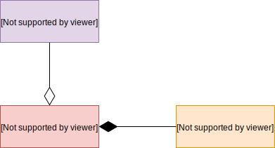
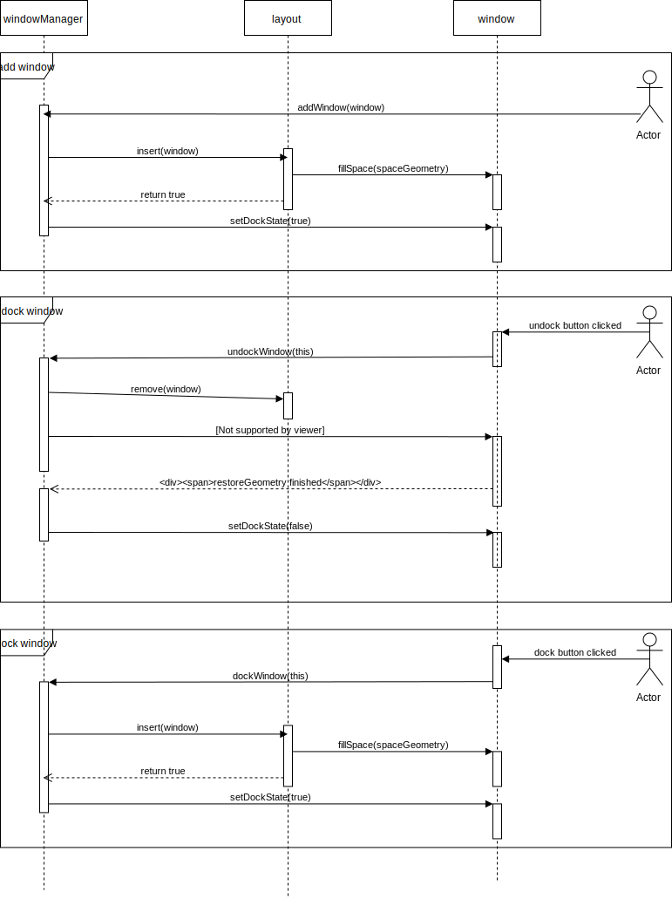

# Window

*Window* component implements application window system providing a base view class for all windows in the application and a number of classes to manage windows.

## Architecture

*Window* component consists of three main entities: [WindowManager](./windowManager/windowManager.md), [WindowView](./windowView/windowView.md), [Layout](./layout/layout.md).

*WindowView* (*window*) is a base class for all windows in the application. To show a *window* on the screen  it should be added to *WindowManager* which will take care about focusing, positioning and docking them. When docking a window *WindowManager* uses *Layout* abstraction which is injected into the *WindowManager*. *Layout* defines how docked windows should be placed and is responsible for tracking docked windows and resizing and repositioning them when needed. *Layout* is an abstraction with [defined interface](./layout/layout.md) that every concrete layout should implement.

*WindowManager* tries to dock a *window* when it is added to the *WindowManager*. *Window* asks *WindowManager* to dock or undock itself when corresponding button is pressed on the *window*. *WindowManager* delegates the search of docked position to a *Layout*. *Layout* takes control over *window*'s position and size after *window* is inserted into the *Layout*.

The sequence diagram below illustrates interactions between *WindowView* (*window*), *WindowManager*, *Layout* and user.

