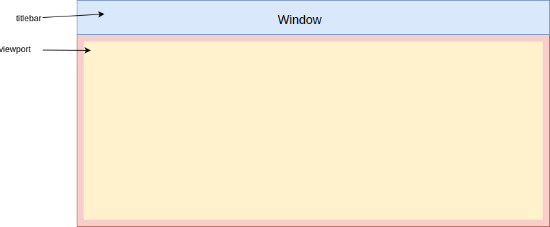

# WindowView

*WindowView* (*window*) is a base class for all windows in the application.

## API reference

Extends the [L.Evented](https://leafletjs.com/reference-1.0.0.html#evented) class therefore it provides convenient subscription methods like *on(...)* and *off(...)*.

Implements [LayoutItem](../layout/layout.md#layoutItem) interface thus is compatible with [Layout](../layout/layout.md).

#### Options
Options object that should be passed to *WindowView* constructor.

| Property | Type | Description |
|---|---|---|
| minWidth | number | *Optional*. Minimum width of the window. Ignored when window is docked. |
| minHeight | number | *Optional*. Minimum height of the window. Ignored when window is docked. |
| maxWidth | number | *Optional*. Maximum width of the window. Ignored when window is docked. |
| maxHeight | number | *Optional*. Maximum height of the window. Ignored when window is docked. |
| width | number | *Optional*. Initial width of the window. |
| height | number | *Optional*. Initial height of the window. |
| class | string | *Optional*. CSS class to assign to the window DOM node. |
| resizable | boolean | *Optional*. Flag indicates if resizing is enabled. Default is `true`. |
| movable | movable | *Optional*. Flag indicates if moving is enabled. Default is `true`. |

#### Properties

| Property | Type | Description |
|---|---|---|
| windowId | number | This property is managed by the [WindowManager](../windowManager/windowManager.md). *windowId* is set when window is added to the *WindowManager*. This field holds a unique value among windows within the same *WindowManager*. |

#### Methods

| Method | Returns | Description |
|---|---|---|
| render() | void | Renders the window. This method is called automatically when the object is created. This method can be called in order to recreate the window after `remove()` was called. After calling this method the `element()` method will return a corresponding DOM Node object. |
| remove() | void | Removes the window. After calling this method the `element()` method will return `null`. It is not recommended to call this method if window is added to a *WindowManager*, in such case please call `close()` method. `remove` [event](#events) is emitted. |
| close() | void | Closes and removes the window. This method correctly handles a scenario when window is added to a *WindowManager*. `remove` [event](#events) is emitted.  |
| isOpen() | void | Window status. Returns `true` if window is opened and `false` if window is closed.  |
| show() | void | Shows the window. |
| hide() | void | Hides the window. |
| element() | Node | Returns the root DOM node that represents the window. Having this node user can place the window wherever it is desired. |
| viewportElement() | Node | Viewport DOM node of the window. Child classes are encouraged to render their content within the viewport node. |
| setTitle(string titleText) | void | Sets a title text for the window. |
| move(number left, number top) | void | Moves the window to a specified position. Position is relative to the surface that holds the window. `moved` [event](#events) is emitted. |
| resize(number width, number height) | void | Resize the window to a specified size. If window is not docked then dimensional limitations are taken into account otherwise limitations are ignored. `resized` [event](#events) is emmited. |
| restoreGeometry(function doneCallback) | void | Restores position and size that window had before been docked. *doneCallback* will be called when geometry is restored, this can happen asynchronously because of transform animation. |
| docked() | boolean | Returns `true` if window is docked otherwise returns `false`. |
| fillSpace([SpaceGeometry](../layout/layout.md#spaceGeometry) spaceGeometry) | void | [LayoutItem](../layout/layout.md#layoutItem) interface method. Changes window position and size according to *spaceGeometry*. Position is relative to the surface that holds the window. If window is not docked then dimensional limitations are taken into account otherwise limitations are ignored. `moved` and `resized` [events](#events) are emitted. |
| getBoundingRect() | [SpaceGeometry](../layout/layout.md#spaceGeometry) | [LayoutItem](../layout/layout.md#layoutItem) interface method. Returns window position and size. Position is relative to the surface that holds the window. |
| onAdd([WindowManager](../windowManager/windowManager.md) windowManager) | void | *Caution: this method should be used only from WindowManager*. WindowManager calls this method when windows is added.  |
| setDockState(boolean docked) | void | *Caution: this method should be used by window owner*. This method sets window dock state. |

#### Extension methods
Every window should extend from *WindowView* and may re-implement (override) the following methods.

| Method | Returns | Description |
|---|---|---|
| onRender(Node viewport) | void | Method is called when window is being rendered. At he time when this method is called all window's DOM nodes are already created so it is safe to refer them from within this method. |
| onRemove() | void | Method is called when window is being removed. |
| onMove() | void | Method is called when window is moved. |
| onResize() | void | Method is called when window is resized. |

#### Events 

| Event | Data | Description |
|---|---|---|
| focus | { windowView: *WindowView* } | Emitted when window gets focused. |
| remove | { windowView: *WindowView* } | Emitted when window is removed or closed. |
| moveStart | { windowView: *WindowView* } | Emitted when a user started moving the window via mouse or via touch. |
| moving | { windowView: *WindowView* } | Emitted when window is moving by a user via mouse or via touch. |
| moveFinish | { windowView: *WindowView* } | Emitted when user stopped moving the window by unpressing a mouse or ending the touch. |
| resizeStart | { windowView: *WindowView* } | Emitted when a user started resizing the window via mouse or via touch. |
| resizing | { windowView: *WindowView* } | Emitted when window is resizing by a user via mouse or via touch. |
| resizeFinish | { windowView: *WindowView* } | Emitted when user stopped resizing the window by unpressing a mouse or ending the touch. |
| moved | { windowView: *WindowView* } | Emitted when window is moved. Move can be caused by user or internally. |
| resized | { windowView: *WindowView* } | Emitted when window is resized. Resize can be caused by user or internally. |
