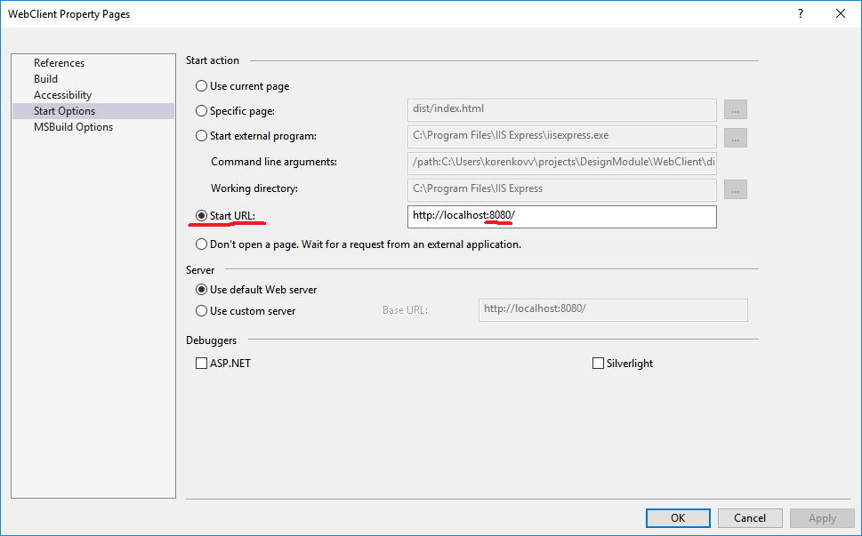
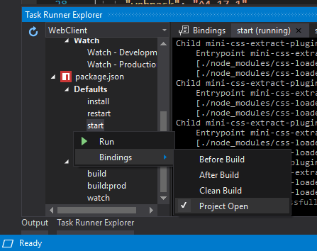
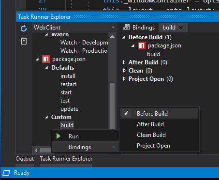

# IDE configuration

This document describes how to configure your IDE to work together with WebPack.

## Visual Studio Code

1. Install [Debugger for Chrome](https://marketplace.visualstudio.com/items?itemName=msjsdiag.debugger-for-chrome) plugin
2. Add the following entry to the `configurations` sction in `.vscode/launch.json` file

```json
{
    "type": "chrome",
    "request": "launch",
    "name": "Launch Chrome against localhost",
    "url": "http://localhost:8080",
    "webRoot": "${workspaceFolder}",
    "sourceMaps": true
}
```

3. Before you start debugging don't forget to run `npm start` from console. This will start a debugger server which will monitor the project folder and will rebuild the project each time code changes.

## Visual Studio 2017

1. Install [NPM Task Runner](https://marketplace.visualstudio.com/items?itemName=MadsKristensen.NPMTaskRunner) plugin
2. Configure start url for debugging 

`Debug -> WebClient Properties... -> Start Options -> (*) Start URL: http://localhost:8080/`



This configuration will ensure that debugger will connect to webpack development server from **3.**

3. *Optional*. Configure webpack dev server to start when project is opened.

This setting should be already configured but in case it is not working for you you can configure it following the instruction below.

`Within Solution Explorer right click on "package.json" -> Task Runner Explorer -> package.json -> Defaults -> right click on "start" -> Bindings -> Project Open`



4. *Optional*. Configure webpack build script to run before debugging.

This setting should be already configured but in case it is not working for you you can configure it following the instruction below.

`Within Solution Explorer right click on "package.json" -> Task Runner Explorer -> package.json -> Custom -> right click on "build" -> Bindings -> Before Build`


