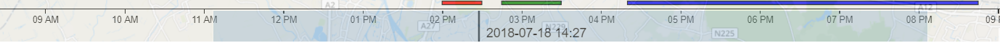
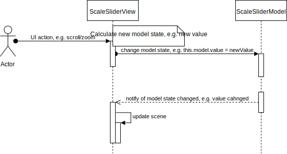

# ScaleSlider

Generic scale-based slider that can work with arbitrary data types. This slider supports selecting a current value, setting a brush and display events on the scale.



## Features

* Displays scale of specified type
* Interaction with current value. Value can by of any type compatible with scale type.
* Support range selection using brush control.
* Can show events on the scale. Supports events selection.
* Supports zooming and scrolling that allows to change the current value.

## Architecture


The component has a simple Model-View design. 

[**ScaleSliderModel**](#ScaleSliderModelApi) <a name="ScaleSliderModel"></a> is the source of the data. The model provides a subscription mechanism for tracking its state. Whenever model state is changed a corresponding event is emitted. Model stores *current value*, *brush* as a range selection and *events* that are objects attached to scale.

[**ScaleSliderView**](#ScaleSliderViewApi) <a name="ScaleSliderView"></a> visually represents the model state on a scale-based slider. When user interacts with the slider and changes *current value*/*brush* these changes are stored into the model. Note that the only source of truth for the view is the model. It means that visual state always reflect the model state and they can't be out of sync. This is achieved in the following way: user interacts with the view => view modifies the model without changing the view itself => if model is ok with the change then model emits a change event => view react on the change event and redraws the scene using the latest model data.


**Note** that model is injected into the view and is not created inside of the view. This allows to create an external object that will manage the model state, e.g. will receive server messages and change the model accordingly.



## API reference

### ScaleSliderModel <a name="ScaleSliderModelApi"></a>
**ScaleSliderModel** extends [L.Evented](https://leafletjs.com/reference-1.0.0.html#evented) class therefore it provides convenient subscription methods like *on(...)* and *off(...)*.

#### Usage example

```javascript
var model = new ScaleSliderModel({
    value: new Date(2018, 6, 18, 14, 0),
    brush: {
        start: new Date(2018, 6, 18, 11, 30),
        end: new Date(2018, 6, 18, 12, 45)
    },
    events: [
        { start: '2018-07-18 14:00', end: '2018-07-18 14:30', color: 'red', tooltip: 'traffic jam' }, 
        { start: '2018-07-18 14:45', end: '2018-07-18 15:30', color: 'green', tooltip: 'no traffic' }, 
        { start: '2018-07-18 16:20', end: '2018-07-18 20:45', color: 'blue', tooltip: 'flood' }
    ]
});
model.on('value', function (data) { console.log(data.value); });
model.on('brush', function (data) { console.log(data.brush); });
model.on('events', function (data) { console.log(data.events); });

model.value = new Date(2018, 6, 18, 17, 0); // 2018-07-18 17:00 will be printed to console
model.brush = brush: {
    start: new Date(2018, 6, 19, 11, 30),
    end: new Date(2018, 6, 19, 12, 48)
}; // { start: 2018-07-19 11:30, end: 2018-07-19 12:48} will be printed to console
model.setEvents([]); // [] will be printed to console
```

#### Options
When constructing a model an options object can be passed to constructor.

| Property | Type | Description |
|---|---|---|
| value | any | Initial value of the model. Can by of any desired type. |
| brush | [Brush](#brush) | **Optional**. Initial brush object. |
| events | Array &lt;[Event](#event)&gt; | **Optional**. Initial events array. |


#### Properties

| Property | Type | Description |
|---|---|---|
| value | any | Current value of the model. When assigning a value to the property a [value](#valueEvent) event is emitted. Can by of any desired type. |
| brush | [Brush](#brush) | Current brush object. Represents range selection on a scale. When assigning a value to the property a [brush](#brushEvent) event is emitted. |
| events | Array &lt;[Event](#event)&gt; | **Readonly**. Property that holds current events that should be displayed on a scale. The only way to modyfy this property is to use [setEvents](#setEventsMethod) or [addEvents](#addEventsMethod) functions. When this property is changed then [events](#eventsEvent) event is emitted. |


#### Methods

| Method | Description |
|---|---|
| setEvents(&lt;Array &lt;[Event](#event)&gt;&gt; events) <a name="setEventsMethod"></a> | Sets a new events array to the *events* property. [events](#eventsEvent) event is emitted. |
| addEvents(&lt;Array &lt;[Event](#event)&gt;&gt; events) <a name="addEventsMethod"></a> | Adds events to existing array in the *events* property. [events](#eventsEvent) event is emitted. |


#### Events

| Event | Data | Description |
|---|---|---|
| value <a name="valueEvent"></a> | {value: &lt;any&gt;} | Event is emitted whenever the *value* property is changed. |
| brush <a name="brushEvent"></a> | {brush: &lt;[Brush](#brush)&gt;} | Event is emitted whenever the *brush* property is changed. |
| events <a name="eventsEvent"></a> | {value: &lt;[Event](#event)&gt;} | Event is emitted whenever the *events* property is changed. |


#### Brush <a name="brush"></a>

| Property | Type | Description |
|---|---|---|
| start | any | Brush range start position. *Should be of the same type as model's value.* |
| end | any | Brush range end position. *Should be of the same type as model's value.* |


#### Event <a name="event"></a>

| Property | Type | Description |
|---|---|---|
| start | any | Event start position. *Should be of the same type as model's value.* |
| end | any | Event end position. *Should be of the same type as model's value.* |
| tooltip | string | Event tooltip text. This should be a brief event description. |
| color | string | Event color string. The value should be compatible with CSS color values. |
| level | number | Event level in a range \[0..\]. Level represents row where this event will be displayed. If Level is not provided then 0 is the default value. |


### ScaleSliderView <a name="ScaleSliderViewApi"></a>

**ScaleSliderView** extends [L.Evented](https://leafletjs.com/reference-1.0.0.html#evented) class therefore it provides convenient subscription methods like *on(...)* and *off(...)*.

#### Usage example

```javascript
var model = new ScaleSliderModel({
    ...
});
...

function createTimeScale(currentTime) {
    var tsStart = new Date(currentTime.getTime() - TimeSliderUtils.DAY);
    var tsEnd = new Date(currentTime.getTime() + TimeSliderUtils.DAY);
    return d3.scaleTime().domain([tsStart, tsEnd]);
}

var scaleView = new ScaleSliderView({
    element: timesliderViewport,
    model: model,
    features: { brush: false },

    // formatter function stands for value representation 
    // when displaying value label
    modelValueDecorator: d3.timeFormat('%Y-%m-%d %H:%M'), 
    
    // function that creates a virtual scale for a given value
    modelValueScaleCreator: createTimeScale
});

scaleView.on('eventSelected', function (data) { 
    console.log('User clicked on the event rectangle', data.event); 
});
scaleView.on('valueClicked', function () { 
    console.log('User clicked on the current value label'); 
});
scaleView.on('zoomLevelChanged', function (zoomLevel) { 
    console.log('User changed current zoom level of the entire scale slider view', zoomLevel); 
});

scaleView.configureFeatures({ brush: false });  // now brush feature is disabled and 
                                                // if there was a brush shown then 
                                                // it will be hidden
```

#### Options <a name="ScaleSliderViewOptions"></a>
When constructing a view an options object should be passed to constructor.

| Property | Type | Description |
|---|---|---|
| element | DOMNode | Parent DOM element that will be used to render the component in it.  |
| model | [ScaleSliderModel](#ScaleSliderModel) | Model object. View will subscribe o its events and will modify the object when necessary. |
| features | Map | **Optional**. Features map. Currently supports only *brush* feature. **true** value stands for enable the feature, **false** for disabling the feature |
| modelValueDecorator | function(&lt;any&gt; value): string | **Optional**. Function that returns text representation of the model value. This text representation will be used to display value label. |
| modelValueScaleCreator | function(&lt;any&gt; value): scale | **Optional**. Function that creates a scale for a given value. In such way the view can be equiped with any kind of scale, e.g. linear, time, logarithmic. Also this function specifies the initial range of values displayed. |
| padding | Object | **Optional**. Padding configuration of the view. Fields are the same as in CSS: top, left, right, bottom. |


#### Methods

| Method | Description |
|---|---|
| render() | Renders the whole view on a parent DOM element. DOM element is provided in constructor within [options](#ScaleSliderViewOptions) object. |
| remove() | Remove the entire scene from the parent DOM element. DOM element is provided in constructor within [options](#ScaleSliderViewOptions) object. |
| resize() | Recalculates new sizes using parent DOM element's size and rerenders the whole view. |
| setZoomLevel(&lt;number&gt; zoomLevel) | Scales the view *zoomLevel* times keeping the current value selected. |
| configureFeatures(&lt;Map&gt; features) | Enables or disables feature listed in the *features* map. |

#### Events

| Event | Data | Description |
|---|---|---|
| valueClicked | undefined | Event is emitted whenever a *value label* is clicked. |
| eventSelected | {event: &lt;[Event](#event)&gt;} | Event is emitted whenever an *event* is clicked/selected. |
| zoomLevelChanged | {zoomLevel: &lt;number&gt;} | Event is emitted whenever *zoomLevel* is changed. |
