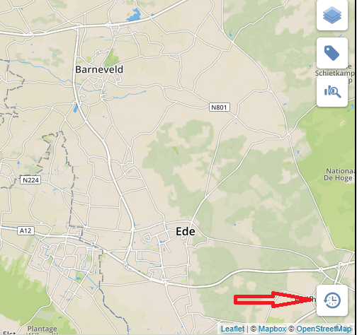
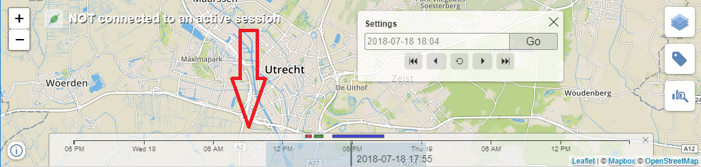
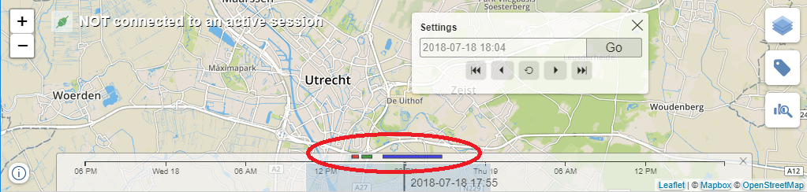

# TimeSlider
UI component for displaying and manipulating a timeline.

It consists of several components
* Toggle button that shows the TimeSlider control when clicked

* TimeSlider control. This control allows setting current time, applying a brush, displaying time-anchored events.

* Time slider settings dialog. Allows more precise setup of the selected date-time. Click on current date label to open the dialog.

## Features
* Display and modify current date-time by scrolling and zooming. 
* A separate Settings dialog window to configure the time.
* Brush to select a time range. Brush can be created and destroyed with right mouse click or long touch.

* Display events anchored to a time range.

* Brush feature can be enabled/disabled from the server side.
* The following can be configured from the server side:
    * current time
    * current brush
    * events (can be set and added)
    * current zoom level    
* The following is reported to the server side:
    * current time
    * current brush
    * selected event
    * current zoom level

## To be done
* Display events in multiline.
* Simulation control that supports the *play*, *stop*, *pause* and *record* actions.
* Zoom over Brush using gestures.

## Architecture

The component has Model View Controller (MVC) design. 

[**TimeSliderController (Controller)**](#TimeSliderControllerApi) is responsible for assimbling altogether. It holds the model and all the views. Controller makes a decision when to show or hide each view. Also controller communicates with server and process server messages. Regarding a server message controller can change the model state or directly ask any view to do some additional actions. Also Controller is responsible for sending messages back to the server, e.g. when model is changed.

**Model**. There is no dedicated model for this component, instead [*ScaleSliderModel*](../scaleSlider/scaleSlider.md#ScaleSliderModel) is used.

**View** is not a single entity but a set of different *View-components*.

**View. TimeSliderToggleView** is a view component that displays a toggle button. *Controller* makes sure that this buttot is shown when the TimeSlider is collapsed. When clicking on the toogle button *Controller* hides the button and shows the TimeSlider.

**View. TimeSliderView** displays the *time slider*. This view uses [*ScaleSliderView*](../scaleSlider/scaleSlider.md) to show the slider and customizes it to show time-based data within a correct scale. The initial scale is `[selectedDte - day, selectedDte + day]`

**View. TimeSliderSettings** is a dialog window that allows setting the selected date.

## API reference

# TimeSliderController 

