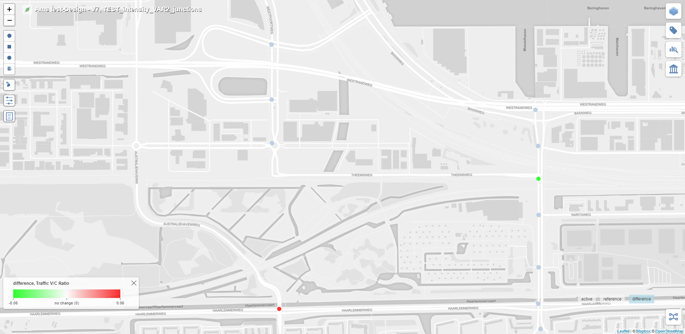

# Tiler Layer: Junctions Pie

This tiler layer has been assigned the LAYER_TYPE number 13 in the database.

The base idea behind this layer is to visualize certain value (VC-ratio in our case) for the junctions using pie-charts.

This layer, as most other layer has 2 parts:
* Scenario layer - This layer is used to visualize data for the selected scenario (active or reference).
* Difference layer - This layer is used to visualize data for the difference between the reference and the active layers.

## Client Requirement

Following is the client requirement provided for the **scenario layer**:

The pie chart slices convey the following information:
* Used capacity
* Remaining capacity

Following is the client requirement provided for the **difference layer**:

The double pie chart slices convey the following information:
* Used capacity (active & reference scenarios)
* Remaining capacity (active & reference scenarios)

## Scenario Layer Logic

For our logic, instead of using hard coded blue color for the 'Used capacity' slice in the pie chart, we use the following color ranges depending upon the value (VC-ratio in our case) that has to be visualized for the junction:

|Class|% Range|Color|
|---|---|---|
|1|0 - 70| Green |
|2|71 - 90| Yellow |
|3|91 - 100| Red |

## Difference Layer Logic

Our current difference layer implementation is dissimilar from the difference layer implementation requested by the client.

The current implementation uses colored points in place of pie charts. The color of these points represent either an improvement or deterioration in class from the reference scenario to the active scenario.

For the difference layer, following are the possible cases:

|Ref Class|Active Class|Diff. Layer Color|
|---|---|---|
|1|1| Neutral |
|1|2| Red |
|1|3| Red |
|2|1| Green |
|2|2| Neutral |
|2|3| Red |
|3|1| Green |
|3|2| Green |
|3|3| Neutral |

As can be seen from the above table, the color of the difference layer is defined by the change is class between the reference layer and the active layer.

If RefClass > ActiveClass, difference layer color is Green.  
If RefClass < ActiveClass, difference layer color is Red.  
If RefClass == ActiveClass, difference layer color is SteelBlue(Neutral).

**Note -** Implementing a difference layer closer to the client's requirements is a task that has been pushed to a later sprint.

## Future Work

There is scope for future improvements for both the 'Scenario layer' & the 'Difference layer'.

For Scenario layer, a `Switch-Layer` should be implemented.  
With the help of switch-layer, at lower zoom levels only colored points will be displayed and on zooming in to a certain depth, these points will be replaced by pie charts.

For Difference layer, an implementation closer to the client requirements is needed.

## Implementation

**Active Layer:**

**Reference Layer:**

**Difference Layer:**

**Active Layer - Zoomed in:**

**Reference Layer - Zoomed in:**

**Difference Layer - Zoomed in:**
