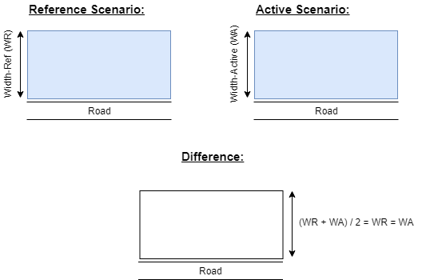
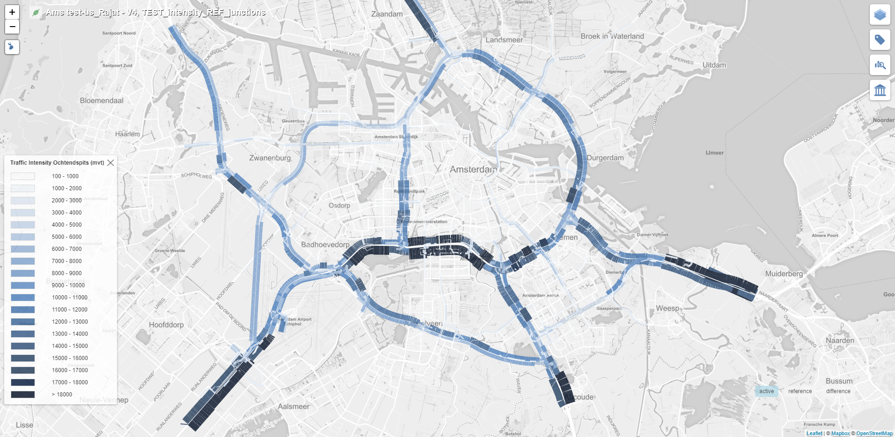
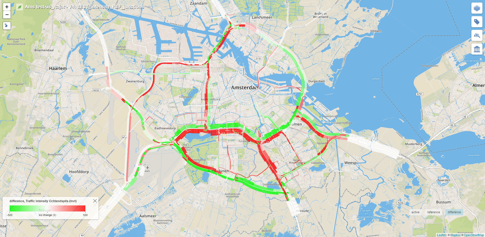

# Tiler Layer 5

Tiler layer 5 is a layer that can be used to display data for both sides of the roads.

Tiler layer 5 can be used to visualize data in 2 ways:
* Color of the layer
* Width of the layer

This layer has 2 class implementations, one to visualize the reference and the active scenario values and the other to visualize the difference between the reference and the active scenarios.

## Layer Logic

A road has two sides - left & right.  
Layer 5 helps visualize data for both sides of the road with the help of colored polygons.

Both the color and the width of the polygon can be used to convey certain type of information regarding a road.

## Difference Layer

Following are the 3 possible cases for the difference layer:

<table class="temperatureViewStates">
<tr><td></td></tr>
<tr align="center"><td>Case 1</td></tr>
</table>

 

<table class="temperatureViewStates">
<tr><td></td></tr>
<tr align="center"><td>Case 2</td></tr>
</table>

 

<table class="temperatureViewStates">
<tr><td></td></tr>
<tr align="center"><td>Case 3</td></tr>
</table>

In the above cases, the width of the polygon in the reference and the active layers represent a certain value parameter for a road.

The width of the difference layer is computed by calculating the average of the widths of the reference and the active layers ((WidthRef + WidthActive) / 2).

The color of the difference layer represents the following:

|Case|Condition|Diff. Layer Color|
|---|---|---|
|1|WidthRef < WidthActive|Red|
|2|WidthRef > WidthActive|Green|
|3|WidthRef == WidthActive|White|

## Implementation

As mentioned above, layer 5 has implementations for two different types of layer.  
1. The Active & the Reference layers.  
2. The Difference layer.

Examples of Active & Reference type layers using layer 5:

---

**Example 1**

**Example 2**

Difference layer using layer 5:

---

**Difference Layer**

