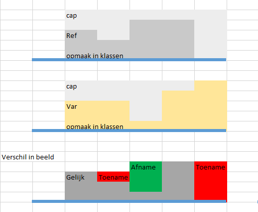
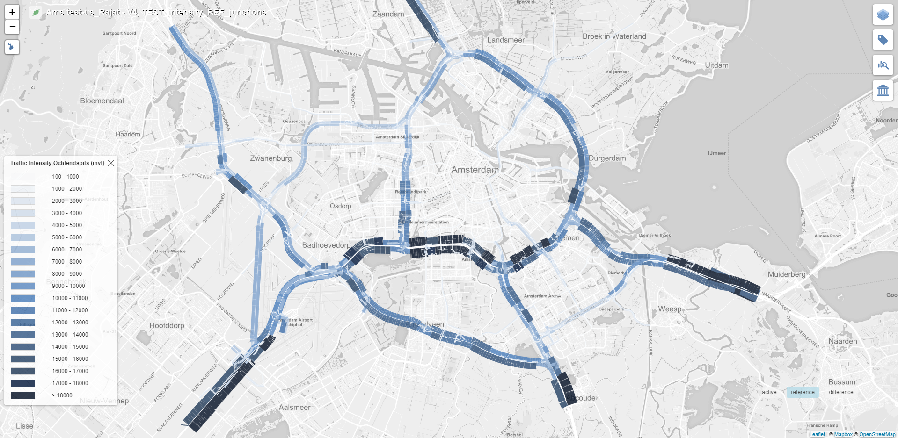
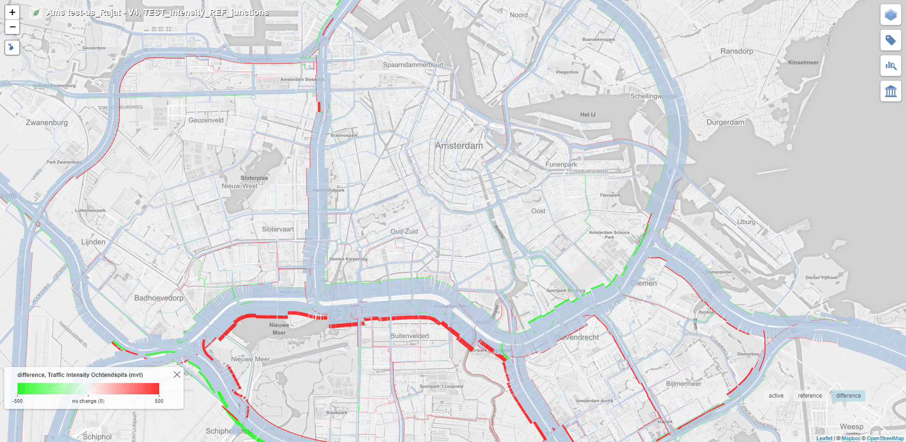

# Tiler Layer 51

Tiler layer 51 is a child of layer type 5. Hence, it inherits the property of visualizing the data on both sides of the road with the help of color filled polygons.

The base idea behind the new difference layer was to highlight only the increase or the decrease in a certain parameter when comparing the reference and the active layers.

## Client Requirement

Following is the client requirement provided for this layer:
 

The first and the second layers represent the data for the reference and the active layers, while the third layer represents the expected difference layer. 

## Logic

As can be seen from the client requirements, following are the three possible cases:

<table class="temperatureViewStates">
<tr><td></td></tr>
<tr align="center"><td>Case 1</td></tr>
</table>

 

<table class="temperatureViewStates">
<tr><td></td></tr>
<tr align="center"><td>Case 2</td></tr>
</table>

 

<table class="temperatureViewStates">
<tr><td></td></tr>
<tr align="center"><td>Case 3</td></tr>
</table>

For the sake of computation, we always calculate the difference between the width of the reference scenario layer with the width of the active scenario layer (WidthRef - WidthActive).

Depending upon the difference (WidthRef - WidthActive), the color of the layer is defined.

|Case|WidthRef - WidthActive|Color|
|---|---|---|
|1|+ve value|Green|
|2|-ve value|Red|
|3|Zero|Neutral|

## Implementation

Layer type 51 reuses the layer computation from its parent layer type 5 for computing the active and the reference layers.

Only a new implementation for the difference layer has been added for this layer.

**Active Layer:**

**Reference Layer:**

**Difference Layer:**

**Difference Layer - Zoomed in:**
