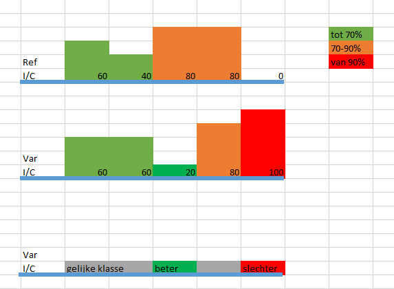
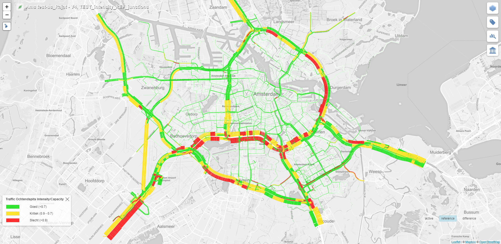
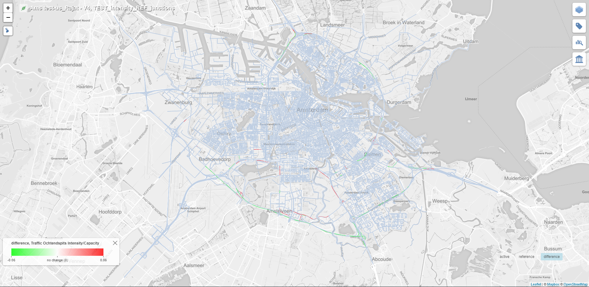

# Tiler Layer 52

Tiler layer 52 is a child of layer type 5. Hence, it inherits the property of visualizing the data on both sides of the road with the help of color filled polygons.

## Client Requirement

Following is the client requirement provided for this layer:

The first and the second layers represent the data for the reference and the active layers, while the third layer represents the expected difference layer. 

## Implementation

Layer type 52 reuses the layer computation from its parent layer type 5 for computing the active and the reference layers.

Only a new implementation for the difference layer has been added for this layer.

Active Layer:

Reference Layer:

Difference Layer:

Difference Layer - Zoomed in:
