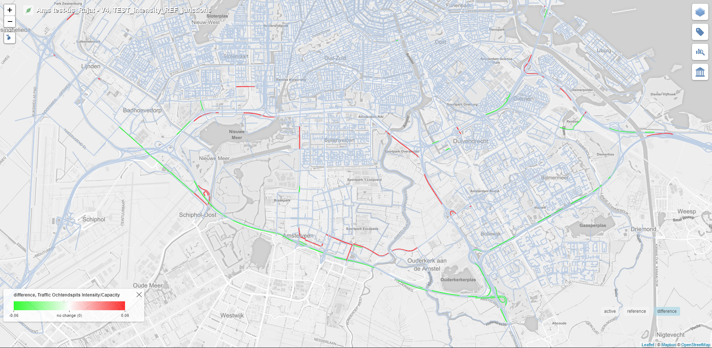

# Tiler Layer: Geometry Class Change Polygon Stripe Left-Right

This tiler layer has been assigned the LAYER_TYPE number 52 in the database.

This layer is related to the [Geometry Polygon Left-Right](./Layer-GeometryPolygonLR.md) layer and hence, it shares the property of visualizing the data on both sides of the road with the help of color filled polygons.

For visualizing values of any scenario (reference or active), the existing class in the layer - [Geometry Polygon Left-Right](./Layer-GeometryPolygonLR.md) is used.  
A new class is implemented for creating the new difference layer visualization.

The base idea behind the new difference layer was to highlight only the change in the class of the values when comparing the reference and the active layers.

## Client Requirement

Following is the client requirement provided for this layer:

The first and the second layers represent the data for the reference and the active layers, while the third layer represents the expected difference layer. 

## Logic - Difference Layer

The data in the reference and the active layers is colored based on the following range criteria for the data value:

|Class|% Range|Color|
|---|---|---|
|1|0 - 70|Green|
|2|71 - 90|Yellow|
|3|91 - 100|Red|

For the difference layer, following are the possible cases:

|Ref Class|Active Class|Diff. Layer Color|
|---|---|---|
|1|1|Neutral|
|1|2|Red|
|1|3|Red|
|2|1|Green|
|2|2|Neutral|
|2|3|Red|
|3|1|Green|
|3|2|Green|
|3|3|Neutral|

As can be seen from the above table, the color of the difference layer is defined by the change is class between the reference layer and the active layer.

If RefClass > ActiveClass, difference layer color is Green.  
If RefClass < ActiveClass, difference layer color is Red.  
If RefClass == ActiveClass, difference layer color is SteelBlue(Neutral).

## Implementation

Layer type 52 reuses the layer computation from its parent layer type 5 for computing the active and the reference layers.

Only a new implementation for the difference layer has been added for this layer.

**Active Layer:**

**Reference Layer:**

**Difference Layer:**

**Difference Layer - Zoomed in:**
