# US Documentation

## General Tables

### PBLS\_PROJECT:

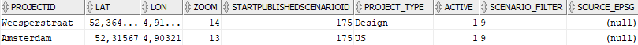
 
**1. PBLS_PROJECT Table**

#### Table creation and modification
SQL to create the table: 

    CREATE TABLE PBLS_PROJECT (
	    PROJECTID VARCHAR2(200) NOT NULL PRIMARY KEY, 
	    LAT NUMBER, 
	    LON NUMBER, 
	    ZOOM NUMBER(*,0), 
	    STARTPUBLISHEDSCENARIOID NUMBER(*,0), 
	    SOURCE_EPSG NUMBER(*,0), 
	    PROJECT_TYPE VARCHAR2(100), 
	    ACTIVE NUMBER(*,0), 
	    SCENARIO_FILTER VARCHAR2(100)
    );
For tables that are missing columns, the publisher will automatically modify them

#### Table consists of the following fields: 
**PROJECTID** 
ID of the project. Must be unique. Only 1 pulisher can run on the same ID at the same time. This ID is used to connect the websocket connections on WS2IMB to the right publisher. Preferably this is a GUID to make them unique and hard to guess, but it can also be a name. 
**LAT/LON/ZOOM** 
Determines the starting position of the webclient on the map. 
**STARTPUBLISHEDSCENARIOID** 
ID of the scenario that will be loaded as default for the clients. Must be a scenario that has a publish-value that passes the ‘SCENARIO\_FILTER’. 
**SOURCE\_ESPG** 
If this field is filled. The filled in ESPG code will be used instead of the default projection. 
**PROJECT\_TYPE** 
Type of publisher that has to be started. At this moment the options are ‘Design’, ‘Monitor’, ‘Evaluate’ and ‘US’. ‘US’ is the default option that will be chosen when the value is not recognized. 
**ACTIVE** 
On a value of 0 this publisher will not be loaded as an option, otherwise it will be. 
**SCENARIO\_FILTER** 
Determines the scenarios from the META\_SCENARIO table that will be available for this project. The filter works on the ‘PUBLISH’ values from the META\_SCENARIO table. ‘;’ can be used as separator chat. So “1;3” will load all scenario’s that have either 1 or 3 as published value. 
  
### META\_SCENARIO:

 
**2. META_SCENARIO Table**

#### Table creation and modification
SQL to create the table: 

    CREATE TABLE META_SCENARIOS (	
	    ID NUMBER NOT NULL, 
	    NAME VARCHAR2(20), 
	    FEDERATE VARCHAR2(30), 
	    PARENT_ID NUMBER, 
	    BASE_ID NUMBER, 
	    SCENARIO_STATUS VARCHAR2(20), 
	    NOTES VARCHAR2(80), 
	    PUBLISHED NUMBER(*,0)
    );

#### Table consists of the following fields: 
**ID** 
ID of the scenario, must be unique. 
**NAME** 
Name of the scenario, must also be unique. Current convention seems to be to always take “V” + ID as NAME. 
**FEDERATE** 
This is the IMB3 prefix where all messages on this scenario will be send on. Read by both the models and publisher. 
**PARENT\_ID** 
Scenarios have a hierarchical structur that is determined by ‘PARENT\_ID’. ‘PARENT\_ID’ denotes from which scenario this scenario descended. In the ini-file of the publisher a flag can be set to tell the publisher whether the webclient should display the scenarios in this hierarchical structure or not. 
**BASE_ID** 
This is used to tell the webclient what to use as default reference scenario. If this field is empty ‘No Reference’ will be the default option in the webclient. 
**SCENARIO\_STATUS** 
Scenarios with a “CLOSED” value will be removed from the list available in the webclient. In practice this has exactly the same result as a scenario with a ‘PUBLISHED’ value not contained in the ‘SCENARIO\_FILTER’. 
**NOTES** 
Description of the scenario. Will be visible in the title of the scenario and in the scenario overview. 
**PUBLISHED** 
Used to determine which scenarios must be loaded. More advanced form of ‘SCENARIO\_STATUS’. Is used as a filter by the publisher. 

### META\_MEASURES:

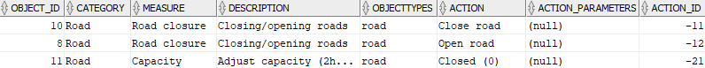
 
**3. META_MEASURES Table**

#### Table creation and modification:

ACTION\_PARAMETERS column is increased in size to support defining the properties. SQL statement for this adjustment: 

    ALTER TABLE META_MEASURES MODIFY (ACTION_PARAMETERS VARCHAR2(2048));
 
SQL to create the entire table:

    CREATE TABLE META_MEASURES (
    	OBJECT_ID NUMBER, 
    	CATEGORY VARCHAR2(100), 
    	MEASURE VARCHAR2(100), 
    	DESCRIPTION VARCHAR2(255), 
    	OBJECTTYPES VARCHAR2(50), 
    	ACTION VARCHAR2(100), 
    	ACTION_PARAMETERS VARCHAR2(2048), 
    	ACTION_ID NUMBER(*,0)
    );

#### Table consists of the following fields: 
**OBJECT\_ID** 
Must be unique, is used as ID. 
**CATEGORY** 
Determines the category under which this measure will be shown in the measures menu. 
**MEASURE** 
Name of the measure. 
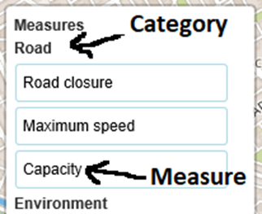
 
**4. Measures Menu** 
**DESCRIPTION** 
At the moment the description is not used. 
**OBJECTTYPES** 
Object type this measure applies to, linked to ‘OBJECT\_TYPE’ from the {scenario-prefix}#META\_OBJECT table. Only if an object of that type is selected will this measure appear in the measure menu. 
**ACTION** 
This is the subcategory of the measures. After a measure is clicked a new dialog is opened showing all the subcategories. 
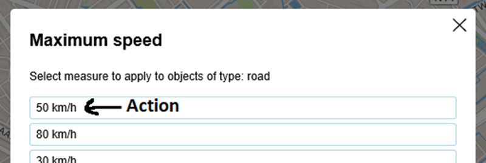
 
**5. Measure Dialog** 
**ACTION\_PARAMETERS** 
This field is either null or contains a json object containing all the information necessary to display properties for this measure. If this field is not null after selecting an action a second dialog window will open displaying all the properties available for this measure. For example: 

    {"properties": 
        [
        	{
        		"name":"Speed",
        		"type":"float",
        		"editable":"true",
        		"value":"20",
        		"ordering":"3",
        		"category":"Traffic"
        	},
        	{
        		"name":"Capacity",
        		"type":"float",
        		"editable":"true",
        		"value":"600",
        		"ordering":"4",
        		"category":"Traffic"
        	},
        	{
        		"name":"Intensity",
        		"type":"float",
        		"editable":"true",
        		"value":"0",
        		"ordering":"5",
        		"category":"Traffic"
        	}
        ]
    }    

Here we have the following fields (case sensitive): 

* **name**: name of the parameter.
* **type**: type of the parameter, options are: int, float, list, string & bool.
* **editable**: “true” -> this property can be edited. “false” -> this property cannot be edited.
* **value**: default value of this property. If there is no default value this field needs to be defined but empty -> “value”:””.
* **ordering**: the properties are sorted by ordering (low to high) and displayed in that order.
* **category**: at this moment this property is passed to the webclient but not used. Can be used in the future to display the properties in their categories.

You can add as many properties as you need, as long as the separate property objects are separated by a comma:

    {“properties”:[{prop1},{prop2},{prop3}…]}
 
Keep in mind all property objects need to contain all the fields mentioned above.
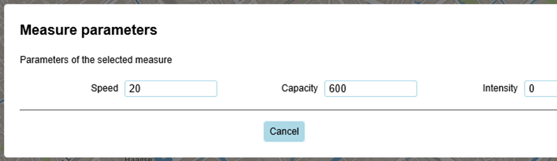
 
**6. Measure Properties** 

**ACTION\_ID** 
This is how the publisher recognizes which measure is selected by the client. The processing of the measure is hardcoded in the publisher. 

## Controls

### GENE\_CONTROL

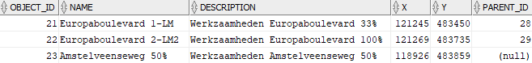
 
**7. GENE_CONTROL Table**

#### Table creation

SQL to create this table:

    CREATE TABLE GENE_CONTROL (
    	OBJECT_ID NUMBER(10) PRIMARY KEY, 
    	NAME VARCHAR2(20), 
    	DESCRIPTION VARCHAR2(20), 
    	X FLOAT, 
    	Y FLOAT, 
    	PARENT_ID NUMBER(10)
    );

#### Table consists of the following fields: 
**OBJECT\_ID** 
ID of the control. 
**NAME** 
Name of the control, will be displayed in the webclient. 
**DESCRIPTION** 
Description of the control, will be displayed in the webclient. 
**X** 
X position of the control in the EPSG that is used in this project. 
**Y** 
Y position of the control in the EPSG that is used in this project. De ‘X’ and ‘Y’ together will be projected to latitude and longitude in the publisher. 
**PARENT\_ID** 
Controls have a hierarchical structure that is determined by their ‘PARENT\_ID’ values. Only controls that don’t have a parent (‘PARENT\_ID’ = null) will be displayed on the map in the webclient. 

### GENE\_CONTROL\_OBJECTS

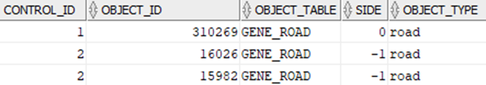
 
**8. GENE\_CONTROL\_OBJECTS Table**

#### Table creation

SQL to create this table:

    CREATE TABLE GENE_CONTROL_OBJECTS (
	    CONTROL_ID NUMBER(10) NOT NULL, 
	    OBJECT_ID NUMBER(10) NOT NULL, 
	    OBJECT_TABLE VARCHAR2(20), 
	    SIDE NUMBER(10), 
	    OBJECT_TYPE VARCHAR2(30)
    );

#### This table will link objects to their control. Table consists of the following fields:

**CONTROL\_ID** 
ID of the control this object is a part of. 
**OBJECT\_ID** 
ID of the object. Relates to the ‘OBJECT\_ID’ field of the table the object is defined in. 
**OBJECT\_TABLE** 
The general tablet his object is defined in (without scenario-prefix). At this moment the OTConnector will only read objects that have “GENE\_ROAD” as value for this field so for now as a workaround all objects will receive a “GENE\_ROAD” value, also when they’re from a different table. 
**SIDE** 
Denotes the side of the object that is selected. Meaning can differ depending on the type of object. For example for roads, 1 means the direction goes from ‘FNODE\_’ (from node) to ‘TNODE\_’ (to node). -1 means the direction is the other way around. 0 means the object is undirected. 
**OBJECT\_TYPE** 
The type of the object. This is linked to the column ‘OBJECT\_TYPE’ from the {scenario-prefix}#META\_OBJECT table. The combination of ‘OBJECT\_ID’, ‘SIDE’ & ‘OBJECT\_TYPE’ are used by the publisher to be able to select objects of a control. In the future the OTConnector should also read and pass along the ‘SIDE’ of the objects. 

### GENE\_CONTROL\_PROPERTIES

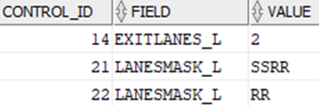
 
**9. GENE\_CONTROL\_PROPERTIES Table**

#### Introduction 
In this table controls are linked to the properties they influence. Important is to notice that, for now, these are still properties that are dependent on the side they influence (\_L or \_R as postfix) but in the future this will be changed to a property without postfix. The selected side will then be read from the GENE\_CONTROL\_OBJECTS table through the ‘SIDE’ field.

#### Table creation

SQL to create this table:

    CREATE TABLE GENE_CONTROL_PROPERTIES (
	    CONTROL_ID NUMBER(10) NOT NULL, 
	    FIELD VARCHAR2(20), 
	    VALUE VARCHAR2(20)
    );

#### This table consists of the following fields:

**CONTROL\_ID** 
ID of the control this property belongs to. 
**FIELD** 
Property being adjusted. In this example it’s a property that only omnitrans understands. So It doesn’t necessarily have to be a US property. 
**VALUE** 
The value the control changes this property to. 

### {Scenario-prefix}#GENE\_CONTROL

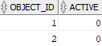
 
**10. {Scenario-prefix}#GENE\_Control Table**

#### Introduction
This table holds the information whether a control is active for each scenario. If a control is not listed in this table it's assumed to be inactive for that scenario (effectively the same as an entry with 'ACTIVE' = 0). So while the table needs to exist to be able to work with controls, not every control needs to be listed in the table. This is done so with adding a control we don't have to update all the {Scenario-prefix}#GENE\_CONTROL tables.

#### Table creation

SQL to create this table:

    CREATE TABLE {Scenario-prefix}#GENE_CONTROL (
	    CONTROL_ID NUMBER(10) NOT NULL, 
	    ACTIVE NUMBER(10) NOT NULL
    ); 

#### This table consists of the following fields:

**OBJECT\_ID** 
The id of the control. Linked to 'OBJECT\_ID' of the general GENE\_CONTROL table. 
**ACTIVE** 
States whether the control is active or not. "0" means inactive, "1" means active. 

## Objects

### {Scenario-prefix}#GENE\_OBJECT

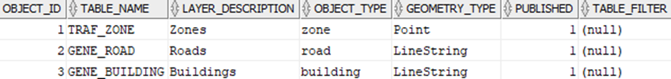
 
**11. GENE\_OBJECT Table**

#### Table creation

SQL to create this table:

    CREATE TABLE {Scenario-prefix}#META_OBJECT (
    	OBJECT_ID NUMBER(10) NOT NULL PRIMARY KEY,
    	TABLE_NAME VARCHAR2(30),
    	LAYER_DESCRIPTION VARCHAR2(100),
    	OBJECT_TYPE VARCHAR2(30),
    	GEOMETRY_TYPE VARCHAR2(30),
    	PUBLISHED NUMBER(10),
    	TABLE_FILTER VARCHAR2(100)
    );

#### This table defines the basic (selectable) layers available in the webclient. Table consists of the following fields:

**OBJECT\_ID** 
ID of this basic layer. 
**TABLE\_NAME** 
Name of the table where the basic objects can be found. This table name should be without the scenario-prefix, this publisher will add the correct prefix according to the scenario. This table should contain both an ‘OBJECT\_ID’ as a ‘SHAPE’ field. 
**LAYER\_DESCRIPTION** 
The layer will receive this tiltle in the webclient. 
**OBJECT\_TYPE** 
Object type. This is used as the key to store the basic layer in the layer dictionay of the scenario it belongs to. Also used to recollect past selections and filter selections and measures. 
**GEOMETRY\_TYPE** 
Denotes the type of shape in the ‘SHAPE’ field, options are: “Point”, “LineString” and “MultiPolygon”. 
**PUBISHED** 
Tells whether the layer should be loaded or not. Layers with a value bigger than 0 will be loaded. Otherwise the layer will not be loaded. 
**TABLE\_FILTER** 
Filter that is applied to all the SQL queries to retrieve the objects from the database. For example “RECEPTOR\_TYPE=2” will only load and visualize objects where RECEPTOR\_TYPE = 2. 

### {Scenario-prefix}#GENE\_OBJECT\_PROPERTY

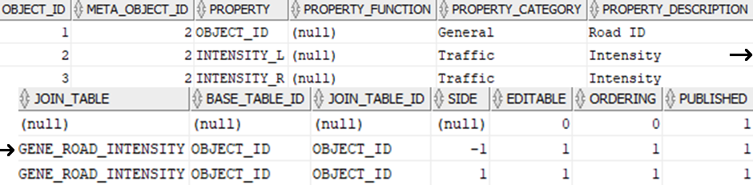
 
**12. GENE\_OBJECT\_PROPERTY Table**

#### Table creation

SQL to create this table:

    CREATE TABLE {Scenario-prefix}#META_OBJECT_PROPERTY (
	    OBJECT_ID NUMBER(10) NOT NULL PRIMARY KEY,
	    META_OBJECT_ID NUMBER(10) NOT NULL,
	    PROPERTY VARCHAR2(30),
	    PROPERTY_FUNCTION VARCHAR2(10),
	    PROPERTY_CATEGORY VARCHAR2(100),
	    PROPERTY_DESCRIPTION VARCHAR2(100),
	    JOIN_TABLE VARCHAR2(30),
	    BASE_TABLE_ID VARCHAR2(30),
	    JOIN_TABLE_ID VARCHAR2(30),
	    SIDE NUMBER(10),
	    EDITABLE NUMBER(10),
	    ORDERING NUMBER(10),
	    PUBLISHED NUMBER(10)
    );

#### This table definies the properties of the objects of the basic layers. Table consists of the following fields: 

**OBJECT\_ID** 
ID of this entry, must be unique. 
**META\_OBJECT\_ID** 
ID of the basic layer this property belongs to. 
**PROPERTY** 
Fieldname of this property. 
**PROPERTY\_FUNCTION** 
At this point this functionality is not fully implemented yet, so for now this doesn’t do anything. In the future you should be able to add stuff here like “SUM”, “MAX” etc. to get aggregated values. 
**PROPERTY\_CATEGORY** 
Not implemented yet in the webinterface. Can be used to display the properties in specific categories. 
**PROPERTY\_DESCRIPTION** 
Name that is shown for the property. These can appear multiple times to link different fields to the same property, further explanation in the ‘SIDE’ field. 
**JOIN\_TABLE** 
The table where the property field is found, if the property comes from the same table as the objects then this value can be left empty. 
**BASE\_TABLE\_ID** 
Should be filled in if a ‘JOIN\_TABLE’ is given. Denotes on what column of the original table the join will be done (normally this will be OBJECT_ID, though OBJECT_ID is not a default value!). 
**JOIN\_TABLE\_ID** 
Should be filled in if a ‘JOIN\_TABLE’ is given. Denotes on what column of the ‘JOIN\_TABLE’ table the join will be done. The total query for the property that the publisher will build will look something like this:
 
    {basis_tabel} t1 join "JOIN_TABLE" t2 on t1."BASE_TABLE_ID" = t2."JOIN_TABLE_ID"

 
**SIDE** 
Denotes for what side this property is meant. (null) is the same as 0 which means no side is selected. The combination of ‘META\_OBJECT\_ID’ + ‘PROPERTY\_DESCRIPTION’ + ‘SIDE’ must be unique. In the screenshots “INTENSITY\_L” or “INTENSITY\_R” will be displayed for the “Intensity” property depending on the side of the selected object. If multiple objects are selected the values will be retrieved from the right columns on an object by object basis. 
**EDITABLE** 
States whether the object should be editable. If the property is editable any applied changes will be written to the database and change messages will be send on IMB. 
**ORDERING** 
Determines the order in which the properties will be displayed (low to high). 
**PUBLISHED** 
Rows with a published value of “0” will not be read, so their properties will not be loaded and visualized. 

## Other changes

### Traffic Indicators

#### Introduction

For the traffic indicator module some tables where added. The indicator module writes to 5 different TRAF\_INDIC\_DAT tables. TRAF\_INDIC\_DAT3 and 4 where re-used since these kpi's already existed. However 3 data tables where added: TRAF\_INDIC\_DAT6, 7 and 8. All these tables should atleast contain an 'OBJECT\_ID'and a 'DISTRICT' field. Apart from that the rest of the needed columns can be defined in the config file of the traffic module (it needs a column for every road\_type group you want it to calculate data for). 

#### Example sql creation code:

    CREATE TABLE {Scenario-prefix}#TRAF_INDIC_DAT8 (
        OBJECT_ID NUMBER(10) NOT NULL PRIMARY KEY,
        DISTRICT VARCHAR2(50),
        ROAD_TYPE1 NUMBER,
        ROAD_TYPE2 NUMBER,
        ROAD_TYPE3 NUMBER,
        ROAD_TYPE4 NUMBER,
        ROAD_TYPE5 NUMBER
    );

### {Scenario-prefix}#TRAF\_ZONE

#### Introduction

The TRAF\_ZONE tables was changed to contain a shape field to allow the publisher to visualize layers for it's objects (both basic and normal layers). To modify an old TRAF\_ZONE table the following SQL statement can be run:

    ALTER TABLE {Scenario-prefix}#TRAF_ZONE ADD (SHAPE MDSYS.SDO_GEOMETRY);
 

Since the TRAF\_ZONE already contained the location of a zone through its 'X\_CENTROID' and 'Y\_CENTROID' field you can run the following statement to fill the shape fields:

    UPDATE {Scenario-prefix}#TRAF_ZONE set SHAPE = MDSYS.SDO_GEOMETRY(
        2001,
        NULL,
        MDSYS.SDO_POINT_TYPE(X_CENTROID, Y_CENTROID, NULL),
        NULL,
        NULL
    );
